# 全流程 AI 创作系统设计文档

> 最后更新：2026-06-09
> 适用项目：`alipro-main`
> 模型约束：生成能力统一调用 `DeepSeek API`
> 设计目标：把“全书 -> 分卷 -> 剧情线 -> 单章 -> 正文”的创作逻辑做成可持续运行的 AI 生产链，而不是零散按钮的拼盘

---

## 1. 文档目的

这份文档要解决的不是“再加几个 AI 按钮”，而是重新定义项目的创作底层逻辑。

当前问题可以用一句话概括：

`系统拿全书起点信息，直接控制单章终点输出。`

这会导致：

- 剧情推进主要依赖模型自洽，不依赖作者掌控
- 角色和大纲在章节层没有真正汇合
- 分卷和剧情线没有成为中间传动层
- 单章细纲缺乏稳定上游
- 正文生成虽然能出文，但长线连贯性不可靠

这份设计文档的目标是：

1. 明确完整创作链路
2. 定义每一层的产出物
3. 定义 AI 在每一步怎么生成
4. 定义每一步输入、输出、确认、回写逻辑
5. 明确首页与资料库的职责分工
6. 保持最终正文生成依旧调用 `DeepSeek API`

---

## 2. 核心创作理念

### 2.1 两条主链

项目的底层不是一条链，而是两条链并行推进：

- `角色线`：负责“谁在推动故事、谁发生变化、谁与谁发生冲突”
- `大纲线`：负责“故事发生什么、怎么推进、推进到哪一步”

### 2.2 两条链的共同层级

两条链都遵循同一层级结构：

```text
全书 -> 分卷 -> 剧情线 -> 单章
```

对应到两条链：

```text
角色线：全书角色 -> 分卷角色状态 -> 剧情线关联角色 -> 单章出场角色
大纲线：全书大纲 -> 分卷大纲 -> 剧情线节点 -> 单章细纲
```

### 2.3 正文生成的本质

正文不是直接由“全书信息”生成，而是由两条链在单章层的结果汇合后生成：

```text
单章正文 = 单章细纲 + 单章出场角色 + 上下文承接 + 当前创作参数
```

这一步非常关键。

如果跳过中间层，正文就会变成：

```text
全书摘要 + 模型自由发挥
```

这不是可控创作，只是高级碰运气。

---

## 3. 总体系统结构

## 3.1 总流程图

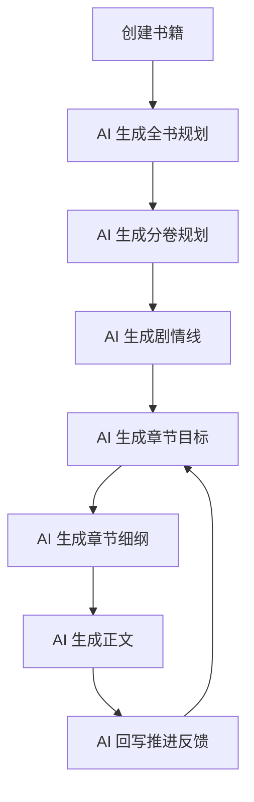

这个循环说明一件事：

`单章生成不是一次性直线流程，而是带轻反馈的循环流程。`

## 3.2 全链路结构图

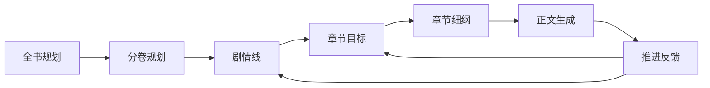

## 3.3 两条链如何在单章汇合

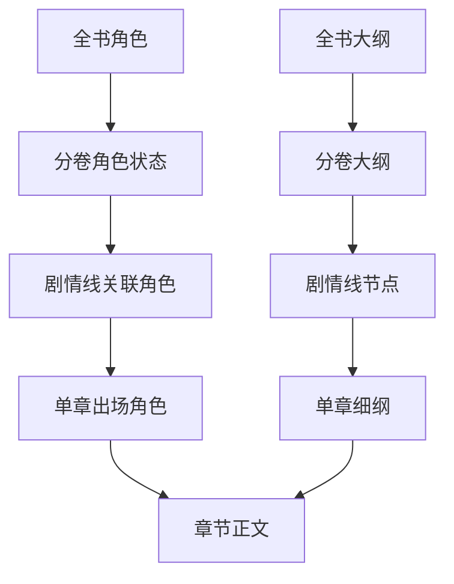

---

## 4. 分层设计

## 4.1 第一层：全书规划层

### 作用

定义整本书的大方向。

### 回答的问题

- 这本书讲什么
- 终局大概是什么
- 核心矛盾是什么
- 主角和关键角色的大弧线是什么

### 产出物

| 类型 | 内容 |
|---|---|
| 全书大纲 | 主线、终局、世界观、核心冲突 |
| 全书角色 | 核心人物、基础关系、长期变化方向 |
| 分卷草案 | 每卷主题、目标、卷末成果 |

### 图示

```text
全书规划
├─ 全书主线
├─ 世界观与规则
├─ 核心角色群
├─ 核心冲突
└─ 分卷草案
```

---

## 4.2 第二层：分卷规划层

### 作用

把全书拆成阶段性推进单元。

### 回答的问题

- 当前这一卷要解决什么阶段问题
- 这一卷角色状态怎么变化
- 这一卷大概推进哪些主战线

### 产出物

| 类型 | 内容 |
|---|---|
| 分卷大纲 | 本卷目标、阶段冲突、卷末结果 |
| 分卷角色状态 | 本卷开始时和结束时的角色状态变化 |
| 剧情线池 | 本卷激活的剧情线清单 |

### 图示

```text
第一卷
├─ 卷目标：站稳脚跟
├─ 卷冲突：外部压迫 / 内部试探
├─ 卷角色状态：主角从被动到主动
└─ 本卷剧情线：成长线 / 阴谋线 / 关系线
```

---

## 4.3 第三层：剧情线层

### 作用

这是本项目最关键的新定位。

剧情线不是章节列表，也不是大纲摘要，而是：

`跨章节持续推进的一条故事任务线`

### 它真正的职责

1. 把分卷的大目标拆成可推进的战线
2. 规定“这一章该推进哪件事”
3. 绑定主要关联角色
4. 为章节目标生成提供中间依据

### 不该让剧情线做什么

- 不负责精确预测“必须写几章”
- 不负责直接替代单章细纲
- 不负责一次性写完自己的全部内容

### 推荐字段

| 字段 | 说明 |
|---|---|
| `storyline_name` | 剧情线名称 |
| `storyline_type` | 主线 / 支线 / 感情线 / 阴谋线 / 成长线等 |
| `goal` | 这条线最终要达成什么 |
| `current_state` | 当前状态，如未开启、已埋线、推进中、关键转折、阶段完成、搁置 |
| `next_step` | 下一步最应该推进什么 |
| `related_roles` | 主要关联角色 |
| `volume_id` | 所属分卷 |
| `priority` | 当前优先级 |

### 推荐规则

- 一个分卷同时激活的剧情线建议 `3~5` 条
- 一个单章同时推进的剧情线建议最多 `3` 条
- 单章必须有且只有 `1` 条主推进剧情线
- 其余只能做辅推进或埋线

### 图示

```text
剧情线：宗门卧底线
├─ 目标：找出卧底并揭开幕后势力
├─ 当前状态：推进中
├─ 下一步：确认嫌疑人是否故意误导主角
├─ 关联角色：主角 / 师姐 / 长老
└─ 所属分卷：第一卷
```

---

## 4.4 第四层：章节目标层

### 作用

章节目标是 AI 生成单章前的中间控制卡。

它不写正文，也不展开细纲，它负责先回答：

`这一章到底要推进什么。`

### 章节目标卡字段

| 字段 | 说明 |
|---|---|
| `main_storyline` | 本章主推进剧情线 |
| `sub_storylines` | 本章辅推进剧情线 |
| `chapter_mission` | 本章核心任务 |
| `emotion_target` | 本章整体情绪方向 |
| `appearing_roles` | 本章必须出场的角色 |
| `ending_hook_direction` | 结尾钩子方向 |

### 一个例子

```text
本章主推进剧情线：宗门卧底线
本章辅推进剧情线：信任关系线
本章核心任务：主角确认假线索来自熟人误导
本章情绪目标：怀疑升级、压迫增强
本章出场角色：主角、师姐、执法长老
本章结尾钩子：线索指向内门
```

### 图示


---

## 4.5 第五层：章节细纲层

### 作用

章节细纲不是被剧情线替代，而是被剧情线校准方向后再展开。

可以理解成：

- `章节目标` 决定这章为什么写
- `章节细纲` 决定这章怎么写

### 章节细纲字段

| 字段 | 说明 |
|---|---|
| `chapter_goal` | 本章目标摘要 |
| `scene_outline` | 场景拆解 |
| `conflict_progression` | 冲突如何升级 |
| `role_usage` | 每个出场角色在本章承担什么作用 |
| `key_reveals` | 本章揭示的信息 |
| `ending_hook` | 本章收尾方式 |

### 场景级结构示例

```text
章节细纲
├─ 开场：主角收到假线索
├─ 第一冲突：与师姐产生分歧
├─ 中段推进：排查中发现线索矛盾
├─ 高潮：主角意识到熟人误导
└─ 结尾钩子：真正目标藏在内门
```

---

## 4.6 第六层：正文生成层

### 作用

正文生成只做一件事：

`把已经确定的章节目标和章节细纲，转成可读的小说正文。`

### 它不是干什么的

- 不是再帮你重新决定剧情走向
- 不是重新改写分卷结构
- 不是自己挑剧情线来推进

它应当尽量少做战略判断，只做战术执行。

---

## 5. 全流程 AI 生成设计

## 5.1 全流程阶段图

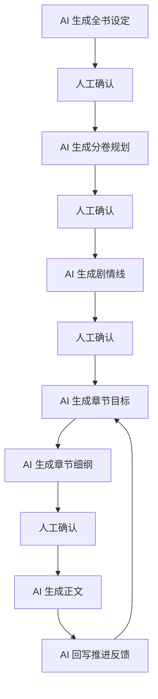

### 为什么要有确认点

如果完全不确认，AI 会层层放大上游偏差。

所以最少保留这几个确认点：

- 全书规划确认
- 分卷规划确认
- 剧情线确认
- 单章细纲确认

## 5.2 用户视角总览

```text
先定整本书
   ↓
再定这一卷要打什么仗
   ↓
再定当前有哪些剧情线在跑
   ↓
再定这一章具体要推进哪一步
   ↓
再写出这一章的细纲
   ↓
最后生成正文并回写反馈
```

---

## 6. 每一步的 AI 生成逻辑

## 6.0 统一生成规则

无论是哪一步，后端都要强制要求 DeepSeek 输出结构化结果，不能只回一段散文式回答。

推荐统一规则：

- 每个生成任务都带明确 `task_type`
- 每个任务都要求输出固定字段
- 每个任务都保留 `reasoning_summary`，用于向用户解释“为什么这样生成”
- 每个任务都保留 `revision_advice`，用于下一轮重生

---

## 6.1 AI 生成全书规划

### 输入

- 书名
- 类型 / 子类型
- 目标平台
- 创作风格
- 核心灵感（可选）
- 基础角色设定（可选）

### 内部生成逻辑

1. 先判断作品类型和平台调性
2. 再推导主线冲突和读者期待点
3. 再生成核心角色框架
4. 最后给出分卷草案

### 输出

- 全书主线
- 世界观摘要
- 核心冲突
- 全书角色框架
- 分卷草案

### DeepSeek 提示重点

- 不直接写章节
- 不提前细化过多支线
- 必须给出可以继续拆分的分卷草案

### 步骤图

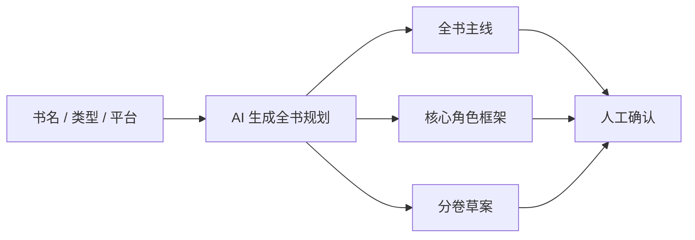

### 作用

给后续所有生成提供顶层约束。

---

## 6.2 AI 生成分卷规划

### 输入

- 全书规划
- 当前卷号
- 上一卷结果（非第一卷时）

### 内部生成逻辑

1. 读取整本书的大目标
2. 判断当前卷在整本书中的阶段位置
3. 生成本卷必须完成的阶段成果
4. 生成本卷角色状态起点与终点
5. 给出本卷适合激活的剧情线范围

### 输出

- 本卷目标
- 本卷阶段冲突
- 本卷关键角色状态
- 本卷建议剧情线数量
- 本卷卷末结果

### DeepSeek 提示重点

- 一卷必须像一个完整阶段
- 卷末要有清晰状态变化
- 不要把所有重要事件都塞进第一卷

### 步骤图

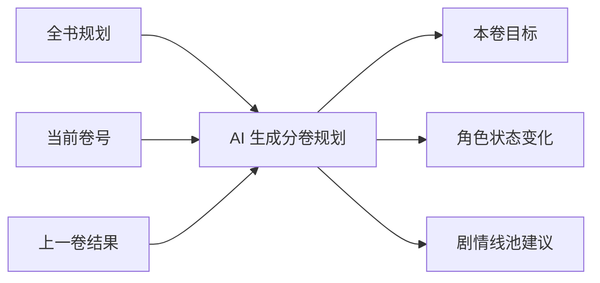

### 作用

定义阶段性推进节奏。

---

## 6.3 AI 生成剧情线

### 输入

- 全书规划
- 当前分卷规划
- 当前卷激活角色

### 内部生成逻辑

1. 从本卷目标中拆出几条可独立推进的战线
2. 为每条战线绑定核心角色
3. 给每条线定义当前状态和下一步
4. 排出主次优先级

### 输出

- 本卷剧情线列表
- 每条线的目标
- 每条线的当前状态
- 每条线的下一步
- 每条线的关联角色

### 生成原则

- 一卷建议 `2~4` 条主剧情线
- AI 给出建议数量，但用户可删减
- 不要求 AI 给出固定章节数

### DeepSeek 提示重点

- 剧情线是“任务线”，不是“章节清单”
- 状态要写成人能看懂的阶段词
- 下一步要可执行，不能写空话

### 步骤图

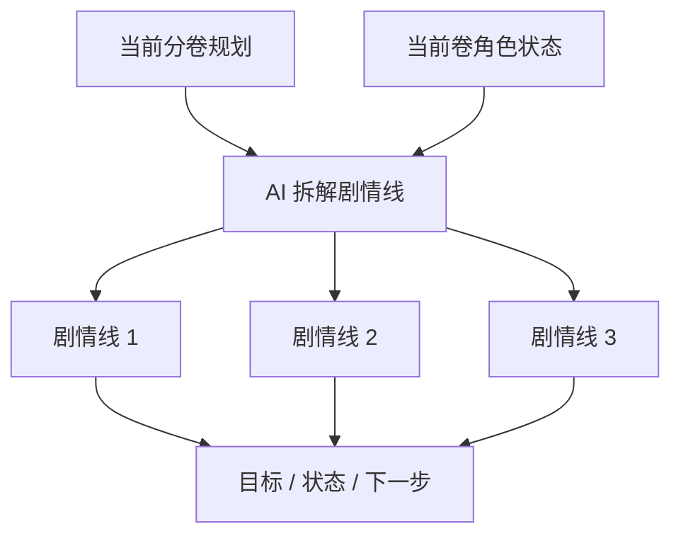

---

## 6.4 AI 生成章节目标

### 输入

- 当前分卷
- 当前剧情线状态
- 上一章推进结果
- 当前角色状态

### 内部生成逻辑

1. 先选定本章主推进剧情线
2. 再选择是否挂载辅推进剧情线
3. 再确定本章核心任务
4. 再确定必须出场的角色
5. 最后确定本章结尾钩子方向

### 输出

- 本章主推进剧情线
- 本章辅推进剧情线
- 本章核心任务
- 本章情绪方向
- 本章出场角色
- 本章结尾钩子方向

### 设计重点

这里不是让 AI 定“写几章”，而是定：

`这一章推进剧情线的哪一步。`

### DeepSeek 提示重点

- 本章只能有一条主推进线
- 辅推进线只是顺带推进或埋线
- 必须写清楚“这一章写完后，什么发生了变化”

### 步骤图

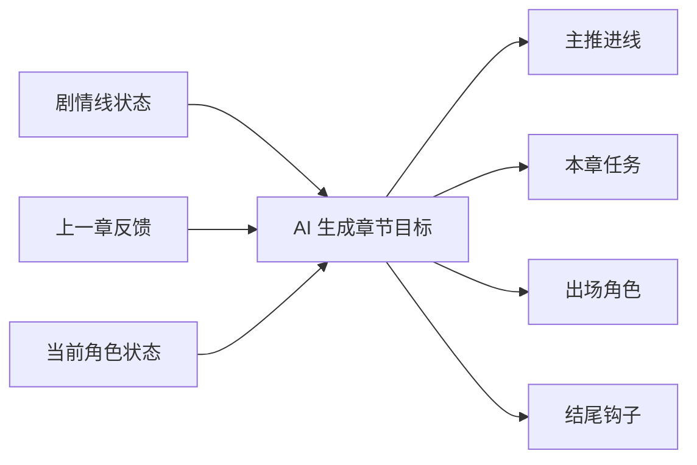

---

## 6.5 AI 生成章节细纲

### 输入

- 章节目标卡
- 当前剧情线细节
- 角色线当前状态
- 上一章承接信息

### 内部生成逻辑

1. 把本章任务拆成场景顺序
2. 为每个场景安排冲突升级
3. 给每个角色安排在本章的作用
4. 安排信息揭示和收尾钩子

### 输出

- 场景序列
- 冲突升级过程
- 角色行动分配
- 信息揭示顺序
- 结尾钩子

### 设计重点

细纲是战术层，不负责战略判断。

### DeepSeek 提示重点

- 细纲必须能直接喂给正文生成
- 每个场景都要知道“为什么存在”
- 不要出现脱离本章任务的炫技段落

### 步骤图

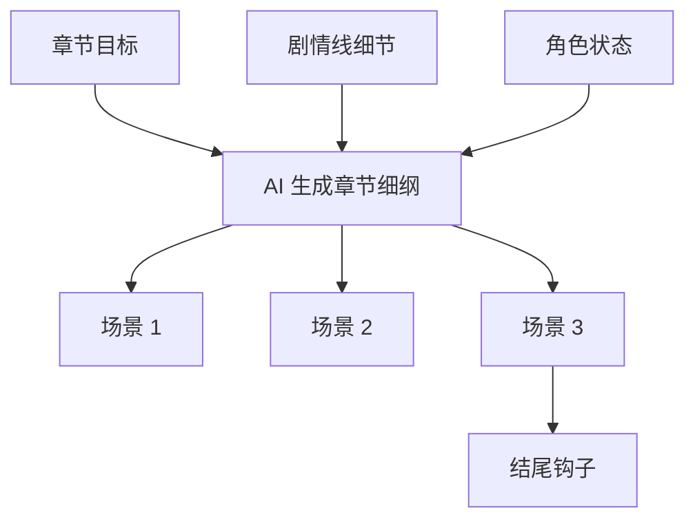

---

## 6.6 AI 生成正文

### 输入

- 当前书籍基础信息
- 当前分卷信息
- 当前剧情线状态
- 当前章节目标
- 当前章节细纲
- 本章出场角色
- 上一章承接信息
- 创作参数（字数、节奏、对话比例等）

### 内部生成逻辑

1. 读取章节细纲作为硬骨架
2. 读取出场角色作为行动边界
3. 读取承接信息避免剧情断层
4. 按创作参数控制节奏、长度和文风
5. 生成正文后进行一次轻自检

### 输出

- 正文章节内容

### 结果位置

- 首页正文结果区
- 当前书籍章节记录

### DeepSeek 提示重点

- 不要跳出章节目标擅自改主线
- 不要新增未设定的重要角色
- 允许润色，但不允许篡改本章任务

### 步骤图

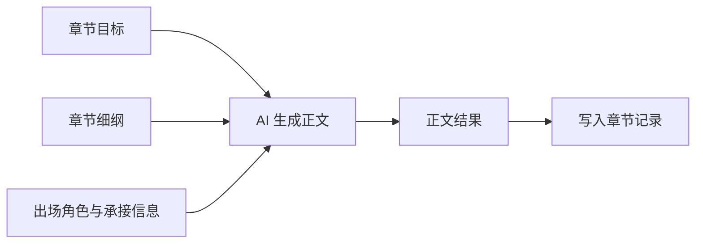

---

## 6.7 AI 回写推进反馈

### 这是必须新增的机制

因为剧情线跨度不是提前定死的，所以正文写完后，系统必须回写一份轻反馈。

### 输入

- 本章目标
- 本章细纲
- 本章正文

### 内部生成逻辑

1. 比对“目标”和“正文”是否一致
2. 判断主剧情线推进是否达成
3. 判断是否推进过头或推进不足
4. 记录角色状态变化
5. 输出下一章最自然的承接点

### 输出

- 主剧情线推进是否达成
- 是否推进过头
- 是否推进不足
- 哪些角色发生了状态变化
- 下一章最自然的承接点

### 图示

```text
章节写完
   ↓
AI 总结推进结果
   ↓
回写到剧情线状态与下一章承接信息
   ↓
下一章目标生成时继续引用
```

### 这一步为什么重要

如果没有反馈回写，系统仍然是单向流水线。

有了它，系统才会真正形成：

`规划 -> 生成 -> 反馈 -> 再规划`

### 步骤图

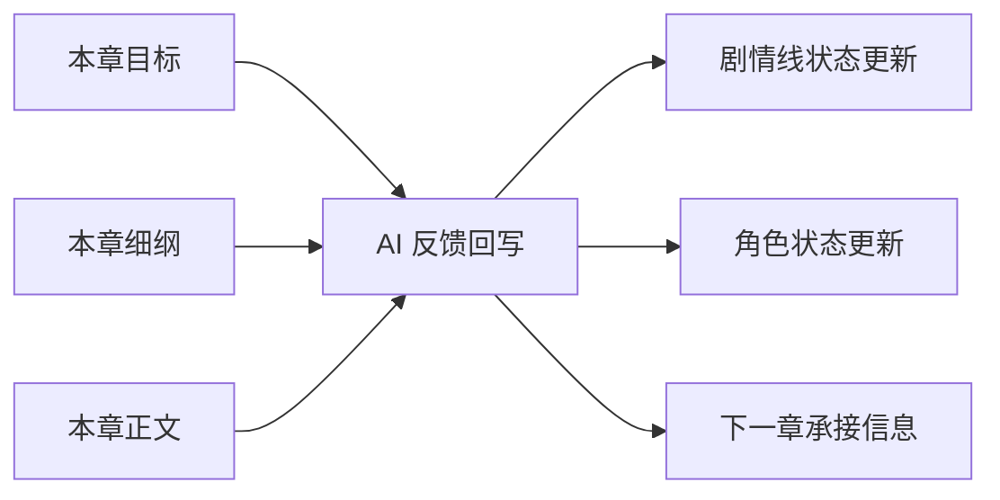

---

## 7. 示例链路：用一本书把全流程跑通

为了避免文档太抽象，下面用一部假想作品演示。

### 7.1 示例书籍基础信息

| 项目 | 示例内容 |
|---|---|
| 书名 | 《夜雨藏锋》 |
| 类型 | 玄幻悬疑 |
| 平台 | 番茄 |
| 风格 | 节奏快、反转强、偏热血 |
| 核心灵感 | 一个边缘弟子被卷进宗门内斗，越查越发现更大的局 |

### 7.2 示例全链路图

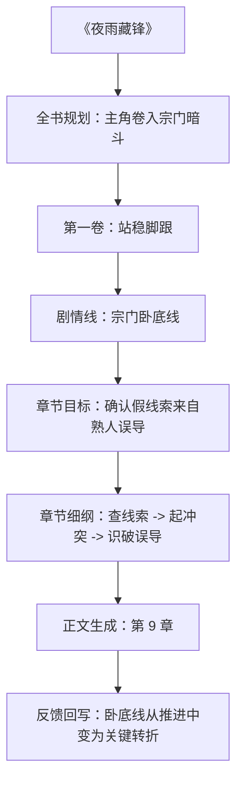

### 7.3 示例分层产出表

| 层级 | 产出示例 |
|---|---|
| 全书规划 | 主角从外门边缘弟子成长为能掀翻内门布局的人 |
| 第一卷 | 目标是让主角站稳脚跟并发现宗门异常 |
| 剧情线 | 宗门卧底线、师门信任线、成长线 |
| 章节目标 | 第 9 章确认“熟人误导”这个关键变化 |
| 章节细纲 | 收到消息、调查、冲突、识破、留钩子 |
| 正文 | 输出完整第 9 章 |
| 反馈 | 卧底线进入“关键转折”，师姐信任度下降 |

---

## 8. 首页与资料库分工

## 8.1 首页定位：创作台

首页不负责全库管理，只负责当前写作调用。

### 首页保留的内容

- 当前书籍
- 当前分卷
- 当前剧情线
- 当前章节目标
- 当前章节细纲
- 当前正文生成

### 首页不应该长期堆的内容

- 全量角色档案
- 所有剧情线列表
- 所有分卷细节
- 历史章节资料总览

## 8.2 资料库定位：规划与资产管理

资料库负责长期维护。

### 资料库应管理的模块

- 全书规划
- 分卷规划
- 剧情线管理
- 角色档案
- 历史章节
- 推进记录

### 一句话区分

```text
首页 = 我现在这一章怎么写
资料库 = 这本书长期都有什么资料
```

---

## 9. DeepSeek API 调用设计

## 9.1 统一原则

生成能力仍然统一走 `DeepSeek API`。

推荐保持统一封装，不在前端直接散调。

### 统一调用结构

```text
前端操作
  -> 后端生成路由
  -> Prompt 组装
  -> DeepSeek API
  -> 结果写库
  -> 前端展示
```

## 9.2 建议的生成任务拆分

| 任务 | 用途 | 建议路由 |
|---|---|---|
| 全书规划生成 | 顶层设定 | `/api/ai/book-plan/generate` |
| 分卷规划生成 | 阶段规划 | `/api/ai/volume-plan/generate` |
| 剧情线生成 | 战线规划 | `/api/ai/storyline/generate` |
| 章节目标生成 | 单章目标卡 | `/api/ai/chapter-goal/generate` |
| 章节细纲生成 | 场景拆解 | `/api/ai/chapter-outline/generate` |
| 正文生成 | 小说正文 | `/api/ai/chapter-content/generate` |
| 推进反馈总结 | 结果回写 | `/api/ai/chapter-feedback/generate` |

## 9.3 推荐统一请求结构

```json
{
  "taskType": "chapter-outline-generate",
  "bookId": "book_001",
  "volumeId": "volume_01",
  "storylineIds": ["storyline_01", "storyline_02"],
  "chapterNo": 9,
  "context": {},
  "userPreferences": {},
  "model": "deepseek-chat"
}
```

## 9.4 推荐统一响应结构

```json
{
  "success": true,
  "taskType": "chapter-outline-generate",
  "data": {},
  "reasoningSummary": "本章应先推进卧底线，再顺带压低信任关系。",
  "revisionAdvice": [
    "如果想让节奏更快，可减少调查场景",
    "如果想强化关系冲突，可增加与师姐的对峙"
  ]
}
```

## 9.5 DeepSeek 调用职责

### DeepSeek 负责

- 创意生成
- 结构拆解
- 文本组织
- 推进总结

### DeepSeek 不负责

- 决定最终数据库结构
- 决定哪些记录覆盖旧记录
- 决定当前书籍是谁
- 决定页面流程权限

这些应由系统逻辑控制，不应交给模型自由决定。

---

## 10. 用户视角的按钮链路

## 10.1 完整操作链

```text
【创建新书】
   ↓
【保存书籍】
   ↓
【AI 生成全书规划】
   ↓
【AI 生成分卷规划】
   ↓
【AI 生成剧情线】
   ↓
进入当前卷
   ↓
【AI 生成章节目标】
   ↓
【AI 生成章节细纲】
   ↓
【生成章节】
   ↓
【AI 回写推进结果】
   ↓
下一章继续
```

## 10.2 首页建议只保留的核心按钮

| 步骤 | 按钮 |
|---|---|
| 全书规划 | `AI 生成全书规划` |
| 分卷规划 | `AI 生成分卷规划` |
| 剧情线 | `AI 生成剧情线` |
| 单章准备 | `AI 生成章节目标`、`AI 生成章节细纲` |
| 正文产出 | `生成章节` |
| 反馈闭环 | `AI 回写推进结果` |

---

## 11. 最小可落地版本

为了避免一次改太大，建议分三步落地。

## 11.1 第一步：先补中间层，不急着全自动

优先落地：

- 分卷模块
- 剧情线模块
- 章节目标模块
- 章节细纲模块

这一步先把结构搭稳。

## 11.2 第二步：让 AI 接管每层生成

逐步加入：

- AI 生成全书规划
- AI 生成分卷规划
- AI 生成剧情线
- AI 生成章节目标
- AI 生成章节细纲

## 11.3 第三步：补反馈闭环

最后加入：

- AI 章节推进反馈
- AI 自动更新剧情线状态
- AI 自动生成下一章建议目标

---

## 12. 风险与控制策略

## 12.1 风险一：多剧情线同时推进导致正文混乱

### 控制策略

- 每章只允许 `1` 条主推进线
- 最多 `2` 条辅推进线
- 超出部分只能作为背景提及，不可强推进

## 12.2 风险二：剧情线推进快慢难判断

### 控制策略

- 不做百分比进度
- 只做状态型进度
- 用“当前状态 + 下一步”替代“进度数值”

## 12.3 风险三：章节跨度提前定死不现实

### 控制策略

- 不要求 AI 预估固定章节数
- 允许剧情线在写作过程中自然伸缩
- 用反馈回写去动态修正

## 12.4 风险四：系统太复杂，用户难用

### 控制策略

- 首页只显示当前创作必要层
- 长期资料全部放资料库
- 保持“书 -> 卷 -> 线 -> 章”选择路径清晰

## 12.5 风险五：AI 直接跳过中间层偷懒

### 控制策略

- 每一步都必须有独立记录
- 正文生成接口必须依赖章节目标和章节细纲
- 没有中间层数据时，不允许直接生成正文

---

## 13. 最终结论

这个项目如果要真正做成“全流程 AI 创作工具”，必须把逻辑从：

```text
全书信息 -> 直接生成单章正文
```

升级为：

```text
全书规划
-> 分卷规划
-> 剧情线
-> 章节目标
-> 章节细纲
-> 正文生成
-> 推进反馈回写
```

其中最关键的新模块不是“再加一个 AI 按钮”，而是：

- `剧情线`
- `章节目标`
- `推进反馈`

它们是作者控制力重新回到系统里的三个关键齿轮。

如果没有这三个中间层，系统再会写，也只是“AI 会写”；
有了这三个中间层，系统才更接近“作者能控，AI 能写”。
