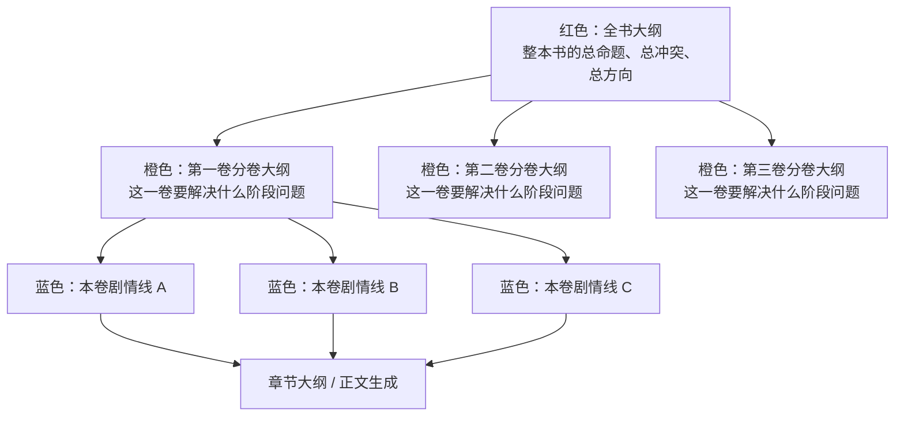
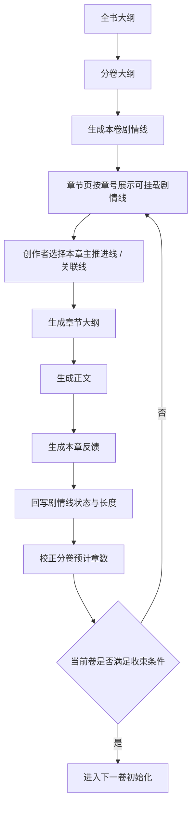

# 剧情线分层与分卷闭环设计

> 适用范围：`alipro-main` 创作主链后续修缮  
> 目标：把“全书大纲 -> 分卷大纲 -> 剧情线 -> 章节大纲 -> 正文 -> 回写校正”整理成一套可理解、可实现、可持续迭代的闭环逻辑。

## 1. 设计目标

这份设计主要解决 4 个问题：

1. 把全书级、分卷级、剧情线级的层级关系彻底理顺。
2. 明确“剧情线先于章节，章节只负责挂载剧情线”，避免顺序写反。
3. 给剧情线一套可生成、可展示、可回写校正的结构。
4. 给“何时收束当前卷并进入下一卷”定义一套能落地的判断逻辑。

## 2. 三层主结构

按你的理解，主结构可以固定成下面这套：

### 2.1 红色：全书大纲

全书大纲只负责定义整本书的长期方向，例如：

- 这本书到底讲什么
- 主角长期要完成什么
- 世界规则是什么
- 这本书的大命题是什么
- 这本书最终会走到哪里

它不直接决定某一章怎么写。

### 2.2 橙色：分卷大纲

分卷大纲负责把全书大纲拆成阶段性任务，例如：

- 第一卷主要解决什么阶段问题
- 第二卷主要进入什么新的矛盾层
- 第三卷主要完成什么人物或命题推进

它是“全书方向”到“具体剧情线”之间的中间层。

### 2.3 蓝色：剧情线

剧情线定义为：

**本卷中的故事链路。**

它来自分卷规划的往下拆解，用来承载当前卷真正发生的故事推进。

剧情线不是章节本身，也不是固定的章目录。

剧情线的职责是：

- 告诉创作者本卷应该出现哪些内容
- 告诉章节规划本章应该挂载哪些推进线
- 在正文生成后可被回写、拉伸、缩短、收束或延后

## 3. 剧情线的定义与分类

剧情线长短不一，可以同时存在，但都必须受分卷范围约束。

### 3.1 贯穿型剧情线

这类线来自全书长期主线，拆到当前卷时形成阶段性推进。

例如：

- 主角寻亲线
- 血脉真相线
- 王朝复仇线

特点：

- 可能跨多卷存在
- 当前卷只推进其中一个阶段
- 当前卷结尾可以阶段性收尾，也可以只推进不收尾

### 3.2 阶段型剧情线

这类线主要服务当前卷的故事推进和主角成长。

例如：

- 进入无名洞府获取传承
- 宗门试炼
- 外门入内门

特点：

- 通常篇幅较短
- 可能只持续数章到十几章
- 完成后可以直接结束

### 3.3 主题型剧情线

这类线更接近一本书的精神底色或命题推进。

例如：

- 修真问道线
- 众生与大道的冲突线
- 从自保到牺牲的价值观升华线

特点：

- 可能贯穿全书
- 也可以拆成每卷不同阶段
- 它不一定总是最热闹的事件线，但常常决定这本书到底在讲什么

### 3.4 钩子型剧情线

这类线本身不一定很长，但很适合承接跨卷内容。

例如：

- 道统斗争伏笔
- 旧势力抬头线索
- 某个神秘人物第一次露面

特点：

- 当前卷可能只露头
- 后续可以在下一卷扩成正式剧情线
- 它很适合做跨卷衔接

## 4. 剧情线的推荐结构

为了后续能生成、展示、回写，剧情线建议至少具备这些字段：

### 4.1 基础信息

- 剧情线名称
- 剧情线类型
- 所属卷
- 剧情线说明
- 这条线服务什么卷目标

### 4.2 范围信息

- 起始章节
- 预计终止章节
- 当前状态
- 是否允许跨卷延续

### 4.3 作用信息

- 它推动哪个主问题
- 它影响哪些角色
- 它是否属于当前卷主线
- 它是否带有后续伏笔责任

### 4.4 收束信息

- 这条线在本卷的理想收束方式
- 如果不收束，下一卷怎么承接
- 当前卷结束时至少要推进到哪一步

## 5. 剧情线生成逻辑

这里的重点不是“随便生成很多线”，而是让剧情线有模板、有边界、有可校正性。

### 5.1 输入

- 分卷目标
- 分卷核心冲突
- 卷初角色状态
- 卷末角色状态
- 预计章节数
- 全书主线
- 主题底色

### 5.2 实现思路

- `混合实现`
- 函数负责把分卷信息整理成“剧情线生成材料”
- 模型负责产出本卷的若干条剧情线草稿
- 函数负责做结构校验、补默认值、保存

### 5.3 建议内置模板

为了让生成结果更稳定，可以给模型预设几种模板，让它按模板组合：

1. `贯穿型模板`
说明：来自全书长期主线，本卷只推进其中一个阶段。

2. `阶段成长型模板`
说明：服务主角成长、试炼、资源获取或局部事件。

3. `主题推进型模板`
说明：服务本书命题、价值观或精神气质。

4. `钩子伏笔型模板`
说明：当前卷只露头，用来连接后续卷内容。

### 5.4 生成目标

生成后的剧情线，不是直接用来写章节，而是先让创作者知道：

- 本卷应该有些什么内容
- 哪些线是主推进
- 哪些线是短期事件
- 哪些线是主题承载
- 哪些线会延伸到后面

这样创作者才能校正和完善。

## 6. 从剧情线到章节的传递逻辑

这一段必须固定原则：

**剧情线不能写成“第 1-10 章固定写 A，第 11-20 章固定写 B”。**

因为真实创作里，多条线会共存、交叠、提前爆发或延后回收。

### 6.1 正确做法

每条剧情线只提供：

- 起始章节
- 预计终止章节
- 当前状态
- 本章是否建议挂载

而不是直接规定每章唯一写什么。

### 6.2 章节层的职责

章节规划页的职责应该是：

1. 根据当前章号，展示“本章可挂载的剧情线”
2. 允许选择：
   - 本章主推进剧情线
   - 本章关联剧情线
3. 在章节大纲生成时，把这些挂载结果传下去

### 6.3 锚点思路

剧情线生成后，可以先按章节范围打锚点，而不是写死。

例如每条线可以只标这些信息：

- 起势区间
- 强化区间
- 转折区间
- 收束区间

章节页只根据当前章号判断：

- 当前章是否落在这条线的有效区间内
- 当前章更适合做起势、推进、转折还是收束

## 7. 正文后的回写校正逻辑

这是你构思里非常关键的一部分，也是闭环成立的核心。

### 7.1 为什么要回写

因为真实写作不会完全按预估走：

- 有些剧情线会比预计更长
- 有些剧情线会提前结束
- 有些分卷预计章数会不够
- 有些短线会意外长成跨卷线

如果不回写，链路永远只是静态规划。

### 7.2 回写对象

正文生成并形成反馈后，应回写：

1. 本章实际挂载了哪些剧情线
2. 哪条线推进了
3. 哪条线没有推进
4. 哪条线进入收束阶段
5. 哪条线已经结束
6. 哪条线需要延长章节范围

### 7.3 回写结果

回写后的剧情线至少要允许调整：

- 预计终止章节
- 当前状态
- 本卷内剩余推进空间
- 是否需要跨卷延续

同时，分卷也允许被校正：

- 当前卷预计章节数
- 当前卷是否已接近收束

## 8. 分卷收束与进入下一卷的闭环

你现在最需要补的是这部分，所以这里给一套能自洽的逻辑。

### 8.1 当前卷不要只靠“写到预计章数就结束”

因为预计章数只能当参考，不能当唯一条件。

### 8.2 当前卷收束建议应由四组条件共同判断

#### A. 卷目标完成度

检查：

- 这一卷的阶段目标是否已经基本实现
- 这一卷的核心冲突是否已经推进到阶段性结果

#### B. 必要剧情线完成度

检查：

- 当前卷定义的主推进剧情线是否至少完成了本卷阶段任务
- 关键短线是否已经结束或转化

#### C. 角色状态完成度

检查：

- 卷初角色状态是否已经变化到预期的卷末角色状态附近
- 如果差距还很大，说明这一卷还没真正走完

#### D. 下一卷承接准备度

检查：

- 是否已经留下足够的跨卷钩子
- 是否已经明确下一卷的起始矛盾

### 8.3 卷收束状态建议

建议把卷状态做成 4 档：

1. `未到收束阶段`
说明：当前卷目标还没完成，关键剧情线还在中段。

2. `可以准备收束`
说明：主目标已大致完成，可以开始回收短线、压缩支线、布置卷末钩子。

3. `满足收束条件`
说明：卷目标、关键剧情线、角色状态、下一卷钩子都已到位，可以进入卷末章节。

4. `需要延卷或拆卷`
说明：预计章数已接近或超出，但核心任务仍未完成，需要人工决定：
   - 延长当前卷
   - 或把后续部分拆到下一卷

### 8.4 进入下一卷的动作

当卷状态进入“满足收束条件”后，应触发：

1. 当前卷冻结为阶段完成
2. 仍未结束但需要延续的剧情线，转成下一卷的承接线
3. 钩子型剧情线如果要扩展，升级为下一卷正式剧情线
4. 下一卷生成时，读取当前卷的卷末状态作为输入

## 9. 推荐的完整闭环

下面这条链，是当前最适合后续修缮的版本：

## 10. 这套设计为什么自洽

### 10.1 层级不打架

- 全书大纲负责长期方向
- 分卷大纲负责阶段任务
- 剧情线负责本卷内部故事链路
- 章节只负责挂载已有剧情线

### 10.2 长线和短线都能容纳

- 长线可以跨卷
- 短线可以本卷终止
- 钩子线可以埋到后面再展开

### 10.3 允许共存，不写死章数分配

不是第 1-10 章固定只写一条线，而是：

- 多条线可共存
- 本章按实际情况选择主推进和关联推进

### 10.4 有回写，就能校正

剧情线和分卷都允许根据正文结果被修正，避免静态计划越写越偏。

### 10.5 有收束标准，就能进入下一卷

不再只靠“预计写到第 20 章”，而是看：

- 卷目标是否完成
- 关键剧情线是否走完阶段任务
- 角色状态是否到位
- 下一卷承接是否准备好

## 11. 建议的修缮顺序

为了避免一次改太大，推荐按下面顺序推进：

1. 先把文档和前端口径统一：
   - 剧情线先于章节
   - 章节只负责挂载剧情线

2. 再补剧情线生成模板：
   - 贯穿型
   - 阶段型
   - 主题型
   - 钩子型

3. 再补章节页剧情线挂载展示：
   - 当前章可挂哪些线
   - 哪条做主推进
   - 哪条做顺带推进

4. 再补正文后回写校正：
   - 校正剧情线长度
   - 校正卷预计章节数

5. 最后补卷收束判断：
   - 进入下一卷前做自动建议

## 12. 一句话结论

你的这套构思可以归纳成一句话：

**全书大纲定总方向，分卷大纲定阶段任务，剧情线定本卷故事链路，章节只负责挂载剧情线，正文结果再反向校正剧情线与分卷长度，最后由卷收束判断决定是否进入下一卷。**
