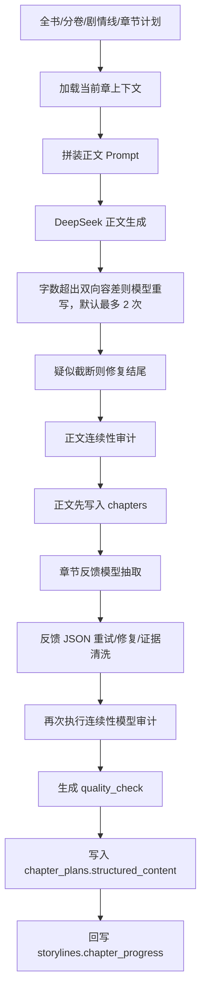

# 后端模型提示词与长篇小说 Harness 深度评估报告

> 评估日期：2026-08-02  
> 评估对象：当前工作区后端模型调用、提示词、连续性判定、反馈回写、批量验收与真实数据库样本  
> 目标：判断现有系统距离“稳定的长篇小说生成 Harness”还有多远，并给出可执行的收敛路线

## 1. 结论先行

当前系统已经具备长篇小说 Harness 的工程雏形，但还不能称为稳定 Harness。

最准确的状态描述是：

- **代码层已经形成多阶段链路**：章节规划 → 正文生成 → 字数重写 → 结尾修复 → 反馈抽取 → 连续性模型审计 → 本地信号补证 → 剧情线进度回写。
- **提示词比普通单轮续写成熟得多**：已经注入全书、分卷、章节、剧情线、上一章反馈、上一章结尾、角色执行边界和动态禁区。
- **真实运行证据没有跟上代码能力**：当前有效数据库样本里，12 章正文对应的 14 份有效章节计划中，正式反馈、质量判定、剧情线上下文、结构化细纲和生成设置的持久化覆盖率全部为 0。
- **当前“系统判定”主要是提示性审校，不是可靠门禁**：判定失败不会阻止正文保存或下一章继续生成；现有三章验收脚本甚至可能把 `warning` / `failed` 判定当作闭环正常。
- **当前最缺的不是再加一段 Prompt，而是可重复、可隔离、可量化的评测底座**：没有黄金样本、缺陷注入集、判定精确率/召回率、Prompt 版本与运行溯源，也没有 20 章以上的自动回归。

综合成熟度评分：**4.6 / 10**。

| 维度 | 评分 | 判断 |
| --- | ---: | --- |
| 正文 Prompt 约束设计 | 7.0 | 上下文丰富、层级较清楚，但重复和过载明显 |
| 长篇上下文组织 | 5.5 | 有全书/卷/章/上一章，但缺长期状态账本和检索压缩策略 |
| 结构化输出与修复 | 7.0 | JSON 格式、重试、清洗较完整 |
| 连续性判定有效性 | 4.5 | 有模型审计和本地信号，但自审偏差大、门禁弱 |
| 剧情线判定有效性 | 4.0 | 主要检查 metadata 是否存在，不足以证明剧情真的推进 |
| 可观测性与可追溯性 | 3.0 | 缺 Prompt/上下文版本、运行记录、成本和判定结果台账 |
| 自动化 Harness | 2.0 | 只有三章闭环脚本，且存在假绿和污染真实数据风险 |

因此，下一阶段不建议继续以“堆叠提示词”为主。优先级应切换为：

1. 修正验收假绿和运行隔离。
2. 建立固定评测集与缺陷注入集。
3. 把长篇状态变成版本化、可审计的结构化账本。
4. 再依据失败数据缩短和重构 Prompt。

### 2026-08-03 实施进度

本节记录报告形成后的代码改造；后文问题描述仍保留为改造前基线，便于审计前后差异。

### 2026-08-04 字数控制统一

字数控制已收敛到 `shared/word-count-policy.json`，前端、后端、DeepSeek Prompt、确定性 Judge、修订循环和 Harness 共享同一份策略：默认 3000 有效字、用户范围 500–10000、通过窗口 ±15%（目标 3000 时为 2550–3450）。有效字按 Unicode code point 计数，并统一排除乱码、控制字符、空白、标点和符号。修订次数、token 预算和扩写/压缩倍率也由该策略集中定义。

详细规则见：[字数控制统一规范.md](./字数控制统一规范.md)。后文若出现旧的字数或 token 公式，以该规范和共享 JSON 为准。

- **P0 基本落地**：三章验收已堵住质量状态、计划锚点、人工复核、字数审计和剧情线待复核的假绿；`generate` 验收只能运行在临时数据库副本；模型参数与流式 `finish_reason` 已真实透传；新增 `generation_runs` 运行台账，记录 Prompt/上下文 hash、模型参数、原始与最终输出、Judge 结果和门禁决策。
- **P1 第一版落地**：新增 30 个固定标注样本（10 正常、20 缺陷），确定性硬检查与语义 Judge 分层；当前固定集样本级 precision/recall 均为 1.0。这个数字只代表当前固定集，不代表真实多题材总体准确率；剧情线正文证据 Judge 和跨题材人工校准仍待继续。
- **P2 底座与长跑已落地**：新增事实事件、角色状态和伏笔账本；章节反馈按章幂等写入，并在下一章生成前按角色和未解决伏笔检索为固定上限的上下文快照。已在隔离数据库完成 20 章与 50 章跨卷付费长跑。
- **P3 已完成工程改造**：正文固定契约进入 `system` 消息，动态资料保留在 `user` 消息；正文 Prompt 建立 `chapter.v1/chapter.v2` 双版本，Prompt 预览可返回 system 内容；离线基准确认 v2 总长度至少缩短 20%。

当前自动回归：27 项通过，其中包含 30 例固定评测集、假绿/隔离门禁、章节上下文选择、账本证据、隔离数据库 Schema、运行溯源、幂等写入、Prompt 双版本、双向字数门禁、重跑范围清理和 50 章跨卷基准准备检查（部分测试项覆盖多个断言）。sql.js 相关测试已改为串行，避免 Node 测试子进程并发时的序列化故障。

### 2026-08-04 质量闭环补齐进度

在 50 章长测暴露“能生成但质量放行率低”的问题后，主生成链路继续补上三层门禁：

1. **生成前规划门禁**：章节细纲、章节任务和 `mustAdvance` 缺失、过短、空泛或互相冲突时，正文模型不会被调用；错误响应会返回具体问题，避免用不合格规划浪费付费生成。
2. **生成后定点修复与复检**：模型审计为 `needs_review/risky` 时最多定点修稿一次；修订稿必须重新通过字数与完整性检查，并且综合风险分明确下降才会替换原稿。没有改善时保留原稿并继续标记复核，避免“修过就算好”。
3. **跨章放行门禁**：严格模式下，上一章没有正式审计、仍需人工复核、计划锚点/字数/剧情线未通过时，下一章自动生成会被阻止。需要保留风险草稿时可以显式使用 `qualityGateMode=off`，但不能伪装成自动通过。

正文、审计和修稿模型现可分别通过 `DEEPSEEK_MODEL`、`DEEPSEEK_JUDGE_MODEL`、`DEEPSEEK_REPAIR_MODEL` 配置；后两项留空时仍沿用正文模型，因此“独立 Judge”只有在配置不同模型后才真正成立。

新增人工校准工具，可从隔离数据库导出正文、上一章结尾、章节规划和当前 Judge 结论，并预留双人盲标所需的连续性、计划落实和六项文学质量评分。校准统计会输出缺陷 precision/recall、误报率、漏报率和争议样本。已从《轮回之门》50 章隔离库生成 50 个待标注样本；目前 `labeled=0/50`，所以还不能声称 Judge 已经达到真实准确率目标。

本轮自动回归提升为 **35 项全部通过**。这证明门禁、择优修复政策和校准工具按预期工作；尚未证明真实章节的文学质量已经达标。下一步验收必须先完成人工盲标和 Judge 校准，再使用同一 20 章黄金基线做付费复测。

同日使用《轮回之门》隔离检查点完成新版质量闭环付费复测，最终第 1-3 章达到 **3/3 全绿**：三章均为 `quality_status=passed`、`verdict=stable`、计划锚点通过、细纲覆盖通过、剧情线推进有效、字数通过、无需人工复核。过程中的失败没有被掩盖，而是推动了以下真实修正：

- 中文正文 token 预算由偏紧的 `0.9 × 目标字数` 调整为 `1.25 ×`，解决“完整句结束但细纲后半段未生成”的隐性截断。
- `outline_coverage_audit` 成为正式语义门禁，明确检查细纲关键事件是否真正发生。
- 自动定点修复最多两轮，每轮复检必须改善；下一章只有在上一章正式放行后才能开始。
- 字数压缩会收到“绝不能删除的剧情结果”，避免为了满足字数删掉力量觉醒、反噬、结尾节点等核心事件。
- Judge 明确写出“不构成问题、无冲突、无实质风险”的自我否定句不再进入正式风险；模型已排除的本地候选风险也不再回流造成假失败。
- 旧剧情线中的占位内容（例如单独的 `1`）会被清除，旧章节任务可作为 `mustAdvance` 兼容来源并显式记录来源。

最终三章验收报告为 `backend/harness-results/quality-loop-paid-1-3-final.json`，隔离数据库为 `backend/harness-results/quality-loop-paid-1-3-v2.db`。这证明新版闭环已能在一个连续三章样本上收敛；它仍不是多题材总体质量证明，20 章黄金基线和人工标注准确率仍待完成。

### 2026-08-04 裁判优先方向修正

三章边测边改只能证明局部链路可收敛，不能证明 Judge 客观，也容易对当前样本过拟合。因此后续路线正式调整为“先建立可信裁判，再测试写作模型”，并停止以生成章数代替裁判准确率。

新版校准框架与正文生成、自动修稿完全分离：

1. 从已有 50 章生成**盲标题册**，不包含任何旧 Judge 结论；旧预测单独保存在隐藏对照文件。
2. 每个样本使用 `sample_hash`，整套题使用 `dataset_hash` 锁定；正文、规划或上一章材料一旦变化，旧预测自动失效。
3. 固定分成 `development=37` 与锁定的 `holdout=13`。只能在 development 调整 Judge，最终验收时才显式解锁 holdout。
4. 两名评审必须独立完成全部样本；结论不一致时必须由第三人裁决，不能用模型意见代替人工真值。
5. Judge 与正文生成使用分离的调用和提示词；可以继续使用 DeepSeek。不同模型或供应商仅作为以后预算允许时的增强项，不是当前前置条件。
6. 每条缺陷必须提供当前正文或上一章结尾的逐字证据。证据在输入中找不到、`pass` 同时携带缺陷、非通过却没有缺陷等情况都会使预测无效。
7. 正式指标为缺陷 precision ≥ 90%、recall ≥ 95%、误报率 ≤ 10%、严重漏报 = 0；development 与 holdout 都必须达标。
8. 超过 3 章的付费长跑需要显式传入 `--allow-paid-long-run`，避免误操作扣费；不再强制要求第二家 API 或 50 章人工标注。

已从《轮回之门》旧 50 章隔离库生成新版盲标题册：`backend/harness-results/judge-calibration-1-50.review.json`，题库 hash 为 `90072cf6156c36868e27d2173fc807e6df1d6dfcb1487660b7cac8de62d2343a`。当前 50 个样本均未完成双人标注，因此状态必须是 `not_ready`；旧同源 Judge 结果被明确标成无效历史基线，不能作为质量证明。此阶段不再继续付费生成。

当前采用“够用优先”的 DeepSeek 单供应商方案：确定性规则负责断章、字数、结构和明确冲突，DeepSeek 的独立裁判调用负责语义质量，失败后只做定点修复并复检。双人标注和独立供应商 holdout 保留为可选的高强度研究方案，不再阻塞实际写作测试。

### 2026-08-04 DeepSeek V4 Flash 十章实测

《轮回之门》第 1—10 章已在隔离数据库完成，最终只读检查为 10/10 章内容、反馈、字数和质量记录齐全。实测同时证明旧 Harness 仍有具体缺陷：第 2、4、9 章出现 Judge 误报，第 10 章“林烬称没听过裴玄度”这一明确跨章冲突被漏掉，第 4 章要求的强行分离任务没有落实，37 条伏笔账本记录全部处于 open 而没有兑现回写；第 8 章还因中文扩写 token 预算偏低连续两次生成短章。

对应修正已完成：过滤句子碎片和动作次数假冲突；计划内开放谜团不再自动判风险；Judge 注入与当前正文人物相关的长期事实与角色账本；“否认认识已接触角色”增加本地硬检查兜底；反馈增加带正文证据的伏笔兑现回写；中文扩写预算提高并允许最多三次收束。当前离线 Harness 回归为 49/49 通过。随后只重审已有正文，不重新生成十章：第 2、4、9 章旧误判均消失，第 10 章准确拦截“裴玄度第 1 章已与林烬接触、第 10 章却称没听过”的矛盾；真实 API 反馈还成功关闭 5 条带正文证据的旧伏笔。完整结论见 `backend/harness-results/deepseek-v4-flash-10chap-assessment.md`。本次没有把隔离章节写回正式数据库，也没有部署服务器。

### 2026-08-03 付费 A/B 实测

使用 DeepSeek `deepseek-v4-flash`，在《破雾修真录》的独立数据库副本上分别运行相同的第 1-3 章：

| 版本 | 通过 | 失败/复核 | 总耗时 | 结论 |
| --- | ---: | ---: | ---: | --- |
| `chapter.v1` | 1/3 | 2/3 | 213.0 秒 | 第 1、2 章计划锚点需要复核，第 3 章通过 |
| `chapter.v2` | 1/3 | 2/3 | 224.2 秒 | 与 v1 同样是第 1、2 章需要复核，第 3 章通过 |

因此 v2 已证明 Prompt 更短，但尚未证明门禁通过率更高；不能把“去重完成”写成“质量已经提升”。两组运行中章节反馈 JSON 都出现过长度截断并成功恢复，后续已把首次反馈输出预算从 1200 提升到 1800 tokens，重试预算提升到 2200 tokens。

Soak Harness 现已支持任意连续章数、失败即停、隔离模式显式继续、JSON 指标报告、临时数据库检查点续跑、重跑范围清理，以及仅在副本中补齐 20/50 章跨卷基准。严格三章复测暴露过字数、截断、计划推进和审计误报问题，尚未取得 3/3 自动全绿，不能声称“严格三章已经稳定通过”。

### 2026-08-04 付费 20/50 章长测

经用户明确授权，使用 DeepSeek `deepseek-v4-flash`，将《轮回之门》的作品规划、角色资料、剧情线、伏笔和隔离生成正文发送到 DeepSeek API。所有正文与反馈只写入隔离数据库检查点，不覆盖正式数据库。

最终按“同一章节只取最后一次续跑结果”合并，第 1-50 章形成完整连续链：

| 指标 | 20 章 | 50 章 |
| --- | ---: | ---: |
| 正文与反馈闭环 | 20/20 | 50/50 |
| 字数门禁通过 | 20/20 | 50/50 |
| 自动全绿 | 2/20 | 2/50 |
| 需复核或阻断 | 18/20 | 48/50 |
| 最终样本 Prompt tokens | 113,708 | 297,398 |
| 最终样本 Completion tokens | 24,382 | 61,325 |

50 章检查点核验结果：50 章都有非空正文、50 份章节计划都有反馈摘要、`generation_runs` 覆盖 50 个章节；连续性账本写入事实事件 150 条、角色状态 165 条、伏笔 136 条。质量分布为 `passed=7 / warning=41 / failed=2`，计划锚点为 `passed=36 / needs_review=13 / skipped=1`。因此结论必须拆开：**生成和字数闭环已经跑通，但自动质量通过率只有 4%，当前 Judge/计划质量仍不适合无人值守放行。**

长跑过程中发现并修复了以下真实问题：

1. 验收端默认 300 秒等响应头会误报 `fetch failed`，现改为显式长请求超时。
2. DeepSeek 高峰期频繁返回 503，现只对 502/503/504 做两次有限退避重试。
3. DeepSeek 偶发返回 200 但缺少 `choices`，曾产生空正文“成功”日志；现按 502 失败并禁止保存。
4. 字数扩写提示最后一条误写成“只输出压缩后的正文”，与前文扩写要求矛盾；现已按扩写/压缩动态输出。
5. 七次全量字数改写会把单章耗时推到 8-17 分钟；现默认最多两次修订，单次流式请求硬时限 4 分钟，严格字数门禁不变。
6. 隔离续跑会清空目标范围旧正文、反馈、台账和剧情线进度，避免失败后沿用旧状态造成假连续。

## 2. 评估范围与证据等级

本报告使用四类证据：

1. **当前源码静态审计**
   - `backend/routes/ai.js`
   - `backend/services/deepseek.js`
   - `backend/services/storyline-generation-service.js`
   - `backend/services/outline-prompts.js`
   - `backend/verify-batch-generation.js`
   - `frontend-react/src/lib/chapterResult.js`
   - `frontend-react/src/lib/generationActions.js`

2. **真实 Prompt 预览**
   - 通过本地 `/api/generate/prompt-preview` 对《轮回之门》第 1、4 章和《破雾修真录》第 8 章取样。
   - 该过程只拼装 Prompt，不调用付费模型。

3. **真实数据库抽样**
   - 数据库：`backend/database/novel.db`
   - 大小：29,691,904 字节
   - 当前有效书籍 3 本、有效正文 12 章、有效章节计划 14 份。

4. **后端日志抽样**
   - `backend/logs/combined.log`
   - 近期日志可以证明 Prompt 预览接口被调用，但没有当前版本下实际生成、反馈、模型审计成功的完整运行记录。

### 证据限制

- 真实正文的更新时间集中在 2026-06-11 至 2026-06-24，早于当前 2026-08-02 代码，因此可以用来验证“当前库里是否形成稳定闭环”，不能直接归因于当前最新版 Prompt。
- 初评轮（2026-08-02）没有调用付费模型；2026-08-03 至 2026-08-04 已补做隔离 A/B 和 3/20/50 章付费实测，仍未覆盖或重写真实章节。文学质量结论以模型审计和工程门禁为主，尚未经过独立人工盲评。
- 正是因为缺少可重复的当前版本运行样本，现有 Harness 的“实际效果”目前无法被工程证据证明；这本身是本次评估最重要的结论之一。

## 3. 当前真实生成链路



这个链路的方向是正确的。它已经从“生成一段文字”升级为“生成 + 提取状态 + 审计 + 写回”。问题不在于有没有环节，而在于：

- 环节之间没有形成可靠门禁；
- 运行证据没有被持久化；
- 验收脚本没有真正验证语义质量；
- 当前数据库看不到这条完整链路成功运行的有效样本。

## 4. 提示词效果评估

### 4.1 做得好的部分

#### 4.1.1 已经建立约束优先级

正文 Prompt 明确区分：

1. 剧情线角色变化边界；
2. 章节角色执行要求；
3. 角色底层资料。

这比把全部资料平铺给模型要好。它能降低“角色卡要求温和，但本章剧情线要求决裂”一类冲突下的随机选择。

证据：`backend/services/deepseek.js:400` 附近的 `buildCreativePrompt()`。

#### 4.1.2 上下文已经覆盖长篇创作的主要层次

当前正文上下文会注入：

- 作品前提、全书目标、核心冲突、世界规则；
- 全书大纲、分卷总规划、当前分卷状态；
- 当前章节细纲、任务、情绪目标和结尾钩子；
- 当前主剧情线、关联剧情线和 beat；
- 角色摘要、角色执行参数；
- 上一章细纲、反馈、正文结尾；
- 上一章新增角色/设定台账和必须承接项；
- 当前允许扩写与禁止空降的动态约束。

证据：`backend/routes/ai.js:3065` 附近的 `loadBookGenerationContext()`。

#### 4.1.3 对“模型乱加设定”已有专项约束

系统不仅在 Prompt 中禁止空降高影响背景，还会：

- 用本地规则提取疑似新角色、组织、地点、道具、规则；
- 让模型复核本地信号，避免把正则命中直接当成事实；
- 对反馈抽取出的新角色、新设定做正文证据过滤；
- 把未被正文证实的台账项阻止写入。

这个设计思想是成熟的：规则负责找候选，模型负责语义判断，写回前再做证据清洗。

证据：

- `backend/routes/ai.js:916` 的台账证据过滤；
- `backend/routes/ai.js:1651` 的本地信号收集；
- `backend/routes/ai.js:4302` 的反馈生成和清洗。

#### 4.1.4 JSON 失败恢复较完整

章节反馈在 JSON 截断或不完整时会：

1. 判断截断原因；
2. 提高 `maxTokens`、降低温度完整重试；
3. 再使用 JSON 修复 Prompt；
4. 修复仍失败才返回错误。

这比“解析失败就静默落本地摘要”可靠。

### 4.2 主要问题

#### 4.2.1 Prompt 约束密度已经偏高

真实预览结果：

| 样本 | 正文 Prompt 字符数 | 行数 | “必须/严禁/不得/不能/硬约束”出现次数 |
| --- | ---: | ---: | ---: |
| 《轮回之门》第 1 章 | 6,255 | 169 | 48 |
| 《轮回之门》第 4 章 | 6,945 | 184 | 50 |
| 《破雾修真录》第 8 章 | 6,551 | 270 | 55 |

这些 Prompt 当前尚未大到不可用，但已经出现三个风险：

- 同一规则在基础 Prompt、动态约束、剧情线约束、生成 Brief 中重复表达；
- “全部都是硬事实”会削弱真正关键约束的注意力权重；
- 规则数继续随长篇状态增长时，会出现约束互相覆盖和模型选择性遵守。

建议把 Prompt 从“自然语言规则墙”改成：

- 10 条以内的固定系统原则；
- 一个结构化 `chapter_contract`；
- 一个结构化 `continuity_ledger`；
- 一个明确的 `must_advance / must_not_happen` 数组；
- 其余资料按需检索，而不是全部展开。

#### 4.2.2 没有真正使用消息角色层级

DeepSeek 调用只发送一个 `user` 消息：

```js
messages: [{ role: 'user', content: prompt }]
```

固定系统规则、用户自定义指令、小说正文和数据库资料都在同一个权限层。后果是：

- 用户补充指令可能与固定约束直接竞争；
- 小说正文或导入资料中的指令式文本可能干扰审计；
- 无法利用 `system` / `user` 的优先级隔离稳定规则与动态内容。

证据：`backend/services/deepseek.js:208` 和 `backend/services/deepseek.js:292`。

#### 4.2.3 模型参数表面可选，实际被硬编码（2026-08-03 已修复）

多个调用方传入 `model`，但 `DeepSeekService.generate()` 和 `generateStream()` 内部固定使用 `deepseek-v4-flash`。这会导致：

- UI 或请求中的模型选择不真实；
- 无法做模型 A/B；
- 日志和返回 metadata 容易让人误以为模型参数生效。

这对 Harness 是基础性问题：连被测模型都不能稳定记录和切换，评测结果就无法比较。当前实现已统一通过运行配置解析模型，并允许调用方显式覆盖。

#### 4.2.4 内置创作模板没有进入主正文链路

`backend/config/templates.js` 保存了多种题材模板，但主正文生成链路只把传入的 `template` 当成一段普通文本输出为“写法模板”。当前前端通常传的是 `fast_pace` 这类写作风格键，而不是数据库里的完整 `prompt_template`。

因此：

- 丰富的内置模板更像配置资产，并没有真正控制主生成 Prompt；
- 模板管理页和实际正文写法可能不是同一条链路；
- 用户以为选择了模板，实际可能只向模型提供了一个英文键名。

#### 4.2.5 输出 Token 预算缺少可靠标定

历史版本的正文 `maxTokens` 使用：

```text
maxTokens = min(6500, max(1200, ceil(targetWordCount * 0.9)))
```

这段公式属于改造前基线。当前版本的 token 预算由共享字数策略计算，并限制在统一上下限；中文字符、有效字和模型 Token 仍不是固定 1:0.9 关系。现有数据库中 12 章有 5 章末尾标点异常，部分样本明确停在半句；这些旧样本不能证明当前版本仍会截断，但证明系统历史上确实受过该问题影响。

此外流式生成没有保留真实 `finish_reason`，结束修复只能依赖文本启发式信号，可靠性弱于同步路径。

#### 4.2.6 Prompt 实现存在重复体系

`backend/services/outline-prompts.js` 定义了全书、分卷、剧情线、时间线、章节细纲等系统 Prompt，但当前只有剧情线和时间线部分被 `storyline-generation-service.js` 使用。正文相关逻辑又在 `routes/ai.js` 和 `deepseek.js` 中独立实现。

这会带来：

- Schema 和约束演进不同步；
- 修改一处 Prompt 不代表真实主链已变化；
- 很难为每个 Prompt 建立唯一版本号和回归基线。

## 5. 系统判定实际效用评估

### 5.1 当前判定分层

当前判定包括：

1. **正文完整性**：截断、半句、引号、格式异常。
2. **跨章衔接**：上一章结尾与当前章开头。
3. **生成事实冲突**：当前章与上一章已生成事实冲突。
4. **角色状态连续性**：性别、状态等前后漂移。
5. **摘要忠实度**：摘要是否反映正文。
6. **章节计划锚点**：`chapter_mission`、`mustAdvance`、`mustNotHappen`。
7. **剧情线进度**：是否记录 storyline / beat metadata，是否有推进摘要。
8. **字数判定**：目标与实际偏差。

分层本身合理，尤其是把“生成数据连续性审计”和“预设计划一致性”分开，避免模型把所有不符合大纲的变化都粗暴判错。

### 5.2 判定目前为什么不能成为稳定门禁

#### 5.2.1 生成模型与审计模型高度同源

正文和审计都由同一服务、同一固定模型执行。模型可能偏好自己的写法，也可能重复同一种理解错误。当前没有：

- 独立 Judge 模型；
- 双 Judge 交叉；
- 确定性规则与模型判定的冲突政策；
- 人工标注集上的准确率证明。

因此 `model_audit` 只能视为一个有价值的语义信号，不能视为客观裁判。

#### 5.2.2 剧情线审计主要在检查 metadata，不是正文语义

`buildStorylineProgressAudit()` 判定剧情线推进的核心条件是：

- `usedStorylineIds` 是否存在；
- `usedBeatIds` 是否存在；
- 是否走 fallback；
- 反馈是否有摘要。

只要这些字段存在，就可能得到 `advanced`。它没有直接验证：

- 正文是否真的完成了 beat；
- beat 是否只被提到但没有推进；
- 是否提前消耗了未来 beat；
- 角色状态是否达到预期变化。

因此它目前更准确的名字应是“剧情线元数据完整性检查”，不是“剧情线推进质量判定”。

#### 5.2.3 判定失败不会阻止正文进入主链

当前流程是先保存正文，再生成反馈和审计。即使：

- `quality_check.status = failed`；
- `needs_human_review = true`；
- `plan_anchor_audit` 判定缺失任务或提前触发；

正文仍然已经写入 `chapters`，下一章也没有统一硬门禁阻止继续生成。

这不是绝对错误——创作工具可以允许带风险保存——但系统必须明确区分：

- `draft_saved`：草稿已保存；
- `audit_passed`：可以自动推进；
- `human_review_required`：不能自动批量继续。

当前状态文案与验收逻辑没有严格执行这个边界。

#### 5.2.4 前端总状态可能掩盖 failed 审计

`frontend-react/src/lib/generationActions.js` 中，完整反馈只要已保存、且不是降级/未运行，就会进入成功状态。`warning` 和 `failed` 没有被列入降级条件。

因此可能出现：

- 顶层提示“正文已生成”；
- 质量卡片内部显示“创作审校未通过”。

这会降低系统判定对用户决策的实际效用。

#### 5.2.5 连续三章验收存在假绿（2026-08-03 已修复）

`backend/verify-batch-generation.js` 会计算：

- `qualityGreen`；
- `planAnchorAuditOk`；
- `needsHumanReview`。

但这些字段没有进入最终 `checks`。`formalQualityCheckOk` 只要求：

- 质量检查存在；
- 来源是 `model_audit`；
- 不是降级或未运行。

这意味着：

- `status = failed` 仍可满足 `formalQualityCheckOk`；
- `plan_anchor_audit = skipped` 仍可能最终 `status = ok`；
- `needs_human_review = true` 也不会让验收失败。

当前这些字段已全部进入最终 checks，并有独立回归用例防止退化。

这是一处必须优先修复的 Harness 假绿风险。

#### 5.2.6 审计 Prompt 的 JSON schema 有格式瑕疵（2026-08-03 已修复）

连续性审计 Prompt 中，`plan_anchor_audit` 字段行与下一行 `verdict` 之间缺少逗号。虽然接口设置了 `response_format: json_object`，模型通常仍可能返回合法 JSON，但 Schema 示例本身不严格，会增加解析失败或字段缺失概率。

#### 5.2.7 本地规则有题材偏置

当前新组织、新道具、新角色检测依赖中文后缀和角色称谓正则，例如“堂、阁、宗、令牌、残卷、长老、执事”等。它对玄幻修真样本较有用，但对：

- 都市职场；
- 现实题材；
- 科幻技术名词；
- 外文人名；
- 无明确后缀的势力名；

召回率会明显下降。规则可保留，但必须通过多题材标注集衡量，而不能默认通用。

## 6. 真实数据揭示的问题

### 6.1 有效业务数据覆盖

| 指标 | 数量 |
| --- | ---: |
| 有效书籍 | 3 |
| 有效正文 | 12 |
| 有效章节计划 | 14 |
| 有效剧情线 | 5 |
| 有效卷时间线 | 1 |
| 有正文的有效计划 | 12 / 14 |
| 有剧情线目标的有效计划 | 14 / 14 |
| 有正式章节反馈 | 0 / 14 |
| 有 `quality_check` | 0 / 14 |
| 有持久化 `storyline_context` | 0 / 14 |
| 有 `usedBeatIds` | 0 / 14 |
| 有结构化章节细纲 | 0 / 14 |
| 有持久化生成字数设置 | 0 / 14 |

这说明当前库里“计划挂了剧情线”与“正文真正按 beat 生成并形成反馈闭环”之间存在断层。

### 6.2 正文完整性信号

12 章正文中：

- 5 章结尾字符可疑；
- 3 章数据库记录字数低于 1,000；
- 1 章把 Markdown 章节标题写进正文；
- 《破雾修真录》第 1、2 章样本明显停在半句。

再次强调：这些正文早于当前最新修复，不能用来断言当前 Prompt 仍会产生同样问题；但它们证明系统需要一个“历史正文重审 + 当前版本回归”的 Harness，而不是只验证新接口返回非空。

### 6.3 数据完整性问题

当前数据库中：

- `chapter_plans` 总数 35，其中 21 条引用不存在的书籍；
- `book_plans` 总数 6，其中 4 条引用不存在的书籍；
- `storylines` 总数 14，其中 9 条引用不存在的书籍；
- 2 条卷时间线中有 1 条属于不存在的书籍。

数据库初始化目前只清理孤儿正文和孤儿角色，没有清理这些规划与剧情线对象。后果是：

- Harness 若按全表统计会被旧测试数据污染；
- 剧情线数量、时间线覆盖率可能看起来比有效业务数据更好；
- 旧的进度回写样本可能被误认为当前有效书籍的闭环证据。

### 6.4 现有剧情线状态并不等于可用

有效剧情线中：

- 《破雾修真录》的主线有 13 个 beat，并存在进度记录；
- 《轮回之门》的 4 条剧情线均有进度记录，但 beat 数量全部为 0；
- 当前有效章节计划又没有持久化 `storyline_context` 和 `usedBeatIds`。

这说明“剧情线有进度”可能来自旧写回、手工数据或兼容链，而不是当前正文生成时对结构化 beat 的可追溯命中。

## 7. 为什么当前还不是长篇小说 Harness

稳定 Harness 至少需要回答五个问题：

1. **这次生成到底用了哪个 Prompt、模型、参数和上下文版本？**
2. **输出违反了哪一条明确契约？**
3. **Judge 的判定在标注集上有多准？**
4. **修改 Prompt 后，质量提升了还是只换了一种错误？**
5. **连续生成 20、50、100 章时，角色、事实、伏笔和节奏如何漂移？**

当前系统无法稳定回答：

- 没有 Prompt 版本/hash；
- 没有上下文快照 ID；
- 没有每次生成的完整运行记录；
- 没有黄金答案和缺陷标签；
- 没有 Judge 精确率/召回率；
- 没有跨版本对比；
- 没有 20 章以上自动 soak test；
- generate 模式直接覆盖真实书籍章节，不具备隔离性；
- 三章验收只检查链路字段，不验证文学质量和长期漂移。

因此，当前的 `verify-batch-generation.js` 更接近“连续三章集成冒烟脚本”，不应作为长篇 Harness 的最终验收器。

## 8. 目标 Harness 设计

### 8.1 核心状态对象

建议把长篇状态收敛为六类版本化对象：

| 对象 | 作用 |
| --- | --- |
| `BookContract` | 世界规则、全书目标、不可变事实、题材与文风 |
| `VolumeContract` | 本卷目标、阶段状态、节奏和收束条件 |
| `ChapterContract` | 当前章必须推进、禁止提前发生、出场角色、目标字数 |
| `ContinuityLedger` | 已发生事实、上一章结果、开放问题、必须承接项 |
| `CharacterStateLedger` | 每个核心角色的地点、关系、知识、状态、能力代价 |
| `ForeshadowLedger` | 伏笔种下、强化、回收、最晚处理章与证据 |

正文 Prompt 不再直接拼接所有原始资料，而是读取一个固定大小的 `GenerationContextSnapshot`：

```json
{
  "book_contract_version": 3,
  "volume_contract_version": 2,
  "chapter_contract": {},
  "recent_continuity": [],
  "relevant_character_states": [],
  "relevant_foreshadowing": [],
  "retrieved_evidence": []
}
```

### 8.2 每次运行必须持久化的溯源信息

建议新增独立生成运行台账，而不是只把最终正文写进 `chapters`：

- `run_id`
- `book_id / chapter_number`
- `prompt_type / prompt_version / prompt_hash`
- `context_snapshot_hash`
- `model / model_version`
- `temperature / max_tokens / response_format`
- 原始输出、修复后输出
- `finish_reason`
- Token 用量、耗时、重试次数
- 各 Judge 原始结果和归一化结果
- 最终门禁决策
- 是否人工覆盖及理由

没有这些信息，就无法做可靠回归。

### 8.3 判定分层与门禁政策

建议将判定拆成三层：

#### 层 1：确定性硬检查

- 输出非空；
- JSON/schema 合法；
- 正文没有标题/Markdown/乱码；
- 结尾完整；
- 字数在范围内；
- 角色姓名不漂移；
- `mustNotHappen` 不得明确触发；
- 关键 ID 和 beat 引用存在。

#### 层 2：语义 Judge

- 本章任务完成度；
- beat 实际推进度；
- 前后章事实冲突；
- 角色状态连续性；
- 摘要忠实度；
- 伏笔是否被错误回收或遗忘；
- 新设定是否有来源。

#### 层 3：文学质量评分

- 场景推进；
- 重复与注水；
- 对话功能；
- 节奏；
- 情绪兑现；
- 钩子质量；
- AI 腔。

推荐门禁：

| 情况 | 决策 |
| --- | --- |
| 正文截断、JSON 无法恢复、触发 `mustNotHappen` | 阻止自动保存，进入修复 |
| 任务缺失、角色/事实冲突 | 保存为待审草稿，禁止批量继续 |
| 新名词或弱证据风险 | 允许保存，标记人工复核 |
| 文学质量偏低但契约完整 | 允许保存，可进入润色阶段 |

### 8.4 固定评测集

第一版建议至少 30 个测试案例：

- 5 种题材，每种 6 个；
- 10 个正常生成案例；
- 20 个缺陷注入案例。

缺陷注入至少覆盖：

- 主角改名；
- 性别漂移；
- 已死亡角色复活；
- 场景瞬移；
- 未完成 `mustAdvance`；
- 提前触发 `mustNotHappen`；
- 编造新势力；
- 编造核心道具；
- 摘要与正文不一致；
- 上章钩子被忽略；
- beat 只提及未推进；
- 伏笔提前回收；
- 字数严重不足/超限；
- 半句截断；
- Markdown 标题污染；
- 反馈台账脑补正文未出现的人物。

每个案例必须有人工标签，才能计算：

- Judge precision；
- Judge recall；
- false positive rate；
- false negative rate；
- 修复成功率。

### 8.5 长篇 Soak Test

至少建立三档：

1. **3 章冒烟**：接口、保存、反馈、回写是否连通。
2. **20 章单卷回归**：角色、事实、beat、伏笔和字数是否漂移。
3. **50+ 章跨卷回归**：卷切换、旧线收束、新线启动、长期状态压缩是否可靠。

每次 Prompt 或 Judge 修改后，至少执行：

- 固定评测集离线重放；
- 3 章冒烟；
- 选定一个 20 章基准作品做回归。

20 章生成必须运行在数据库副本或临时数据库，绝不能覆盖真实作品。

## 9. 分阶段改造路线

### P0：先让现有验收可信

优先级：最高。

1. 修复 `verify-batch-generation.js` 假绿：
   - `qualityGreen` 必须进入最终 checks；
   - `planAnchorAuditOk` 必须进入 checks；
   - `needsHumanReview` 在自动批量模式必须失败；
   - 字数审计必须进入 checks；
   - storyline `needs_review` 不能默认等价于通过。
2. generate 模式改为临时数据库/克隆书籍运行。
3. 持久化 Prompt、上下文、模型和参数版本。
4. 修正模型参数硬编码和流式 `finish_reason` 丢失。
5. 清理或隔离孤儿规划数据，避免统计污染。

验收标准：同一个缺陷输入每次都能得到同一类失败状态，且不会修改真实作品。

### P1：建立可量化 Judge

1. 建立 30 个以上人工标注案例。
2. 将确定性规则与语义 Judge 分开计分。
3. 将剧情线审计从 metadata 检查升级为正文证据检查。
4. 校准各题材本地规则召回率。
5. 记录 Judge 原始输出，不只保存归一化状态。

验收标准：关键硬缺陷召回率优先达到可接受水平，并明确已知误报边界。

### P2：把长篇记忆改造成状态账本

1. 建立 `CharacterStateLedger` 和 `ForeshadowLedger`。
2. 将当前“一章反馈”升级为可追溯事实事件。
3. 每章生成前构建固定大小的上下文快照。
4. 只检索与本章角色、地点、剧情线、伏笔相关的历史证据。
5. 对摘要链做事实回查，防止摘要漂移层层放大。

验收标准：20 章回归中，关键角色状态、核心事实和伏笔状态可逐章追溯。

### P3：再优化 Prompt

1. 固定规则进入 `system` 消息。
2. 动态资料进入结构化 `user` 内容。
3. 删除重复约束和未生效模板。
4. 为每种 Prompt 建立唯一 ID、版本和 Schema。
5. 通过固定评测集做 A/B，不凭主观阅读决定 Prompt 好坏。

验收标准：Prompt 缩短后，契约遵循率不下降，成本和延迟可测量下降。

## 10. 建议的最终成功标准

只有同时满足以下条件，才能把系统称为“稳定长篇小说 Harness”：

- 任何一次生成都能完整复现其 Prompt、上下文、模型和参数；
- 固定缺陷集可以稳定检出角色、事实、剧情线、伏笔、截断等问题；
- Judge 的准确率有人工标注数据支撑；
- 审计失败能触发清晰、可配置的门禁；
- 批量验收不会覆盖真实数据；
- 至少有一套 20 章单卷回归稳定通过；
- 至少有一套 50 章以上跨卷回归能够量化长期漂移；
- Prompt 修改可以通过同一套基准做前后对比；
- 当前有效业务数据中能看到正文、反馈、质量判定、剧情线 beat 和状态账本的完整闭环。

## 11. 最终判断

当前后端最有价值的资产不是某一条 Prompt，而是已经形成的“规划—生成—反馈—审计—回写”方向。这套方向值得保留。

当前最需要警惕的是：代码里的结构让系统看起来已经很完整，但真实数据、验收脚本和判定门禁还不足以证明它稳定。继续叠加 Prompt 会让系统更复杂，却不会自动让结果更可信。

下一步的正确重心应是：**先把评测做真、把状态做实、把假绿堵住，再优化模型写法。**
