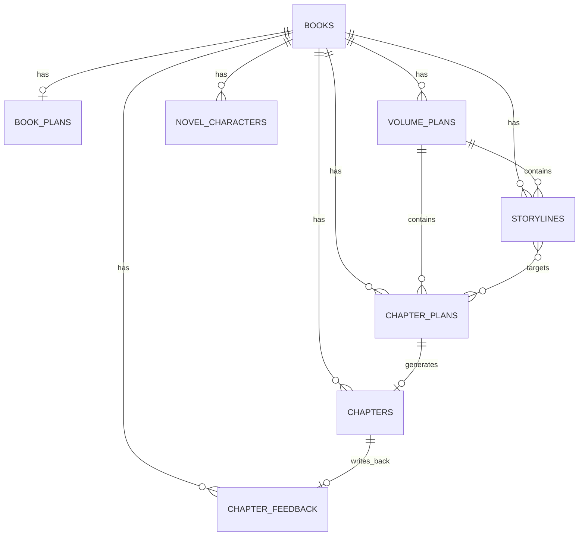

# 全流程 AI 创作数据库结构设计文档

> 最后更新：2026-06-09
> 适用项目：`alipro-main`
> 目标：把“全书规划 -> 分卷规划 -> 剧情线 -> 章节目标 -> 章节细纲 -> 正文生成 -> 推进反馈”落到真实可用的数据结构上
> 设计原则：尽量复用现有表，分阶段收口，不搞一刀切重建

---

## 1. 这份文档是干什么的

如果上一份文档解决的是：

`创作逻辑应该怎么跑`

那这一份解决的就是：

`这些逻辑最后要存成什么数据，谁和谁是什么关系，生成时该读哪里，生成后该写哪里`

它主要回答 4 个问题：

1. 项目现在已经有哪些表，它们各自干什么
2. 哪些表可以继续用，哪些只是历史兼容层
3. 全流程 AI 创作真正需要哪些核心数据对象
4. 后面如果要实施，数据库该按什么顺序改

---

## 2. 先说人话版结论

你现在这个项目的数据库，不是没有结构，而是：

- 已经有一部分能用的核心表
- 也混着几套历史时期留下来的存法
- 有些表已经接近目标
- 有些表还在“兼职干活”

最关键的判断是：

- `books` 可以继续作为书籍主表
- `chapters` 可以继续作为正文章节主表
- `chapter_plans` 已经很接近“章节规划主表”
- `storylines` 可以继续作为剧情线主表
- `novel_characters` 可以继续作为角色主表，但需要分层使用
- `novel_outlines` 不能再继续无限膨胀，它更适合逐步退为兼容层
- `volume_settings` 适合作为分卷配置层，但不够承担完整分卷规划
- `volume_timelines` 目前更像辅助结果表，不适合当创作主链核心

一句话概括：

`后面不是推翻重来，而是把“谁是正式主表、谁是临时兼容层”定清楚。`

---

## 3. 现有数据库对象怎么理解

## 3.1 当前已经存在且值得保留的主对象

| 表名 | 当前定位 | 建议未来定位 |
|---|---|---|
| `books` | 书籍基础信息 | 保留为书籍主表 |
| `chapters` | 章节正文 | 保留为正文主表 |
| `chapter_plans` | 章节规划草稿 | 升级为章节目标/细纲主表 |
| `novel_characters` | 角色资料 | 保留为角色主表 |
| `storylines` | 剧情线管理 | 保留并扩展为剧情线主表 |
| `volume_settings` | 分卷基础配置 | 过渡期保留，逐步并入分卷规划主表 |
| `volume_timelines` | 卷级时间线结果 | 保留为辅助生成结果表 |

## 3.2 当前存在但不建议继续当核心主表的对象

| 表名 | 当前问题 | 后续建议 |
|---|---|---|
| `novel_outlines` | 同时承担全书/分卷/章节三种大纲，责任太重 | 逐步降级为兼容层或缓存层 |
| `chapters.outline` | 和章节规划功能重叠 | 逐步弱化，仅保留兼容 |

这两个就像“以前为了图方便塞进一个抽屉的杂物”，不是完全没用，但不能再拿它们当整个系统的大脑。

---

## 4. 最终推荐的数据分层

建议后续把数据世界正式整理成 8 层：

```text
书籍
  -> 全书规划
  -> 分卷规划
  -> 剧情线
  -> 章节目标
  -> 章节细纲
  -> 正文
  -> 推进反馈
```

对应到数据库层，可以拆成下面这些正式对象：

| 层级 | 推荐主表 |
|---|---|
| 书籍 | `books` |
| 全书规划 | `book_plans` |
| 分卷规划 | `volume_plans` |
| 剧情线 | `storylines` |
| 章节目标 + 章节细纲 | `chapter_plans` |
| 正文 | `chapters` |
| 推进反馈 | `chapter_plans.structured_content.chapter_feedback`（当前） / `chapter_feedback`（目标） |
| 角色 | `novel_characters` |

注意一个重点：

`角色不是单独一条创作步骤，但它是全流程都要调用的基础层。`

另外要特别区分“当前态”和“目标态”：

`chapter_feedback` 目前在项目里还不是独立表，当前真实挂载位置是 `chapter_plans.structured_content.chapter_feedback`。文档里单独写 `chapter_feedback` 的地方，如果没有特别说明“目标态”，都应按这个当前实现理解。

---

## 5. 推荐的表关系总图

下面这张图里的 `CHAPTER_FEEDBACK` 属于目标态设计，不代表当前数据库已经有这张表。



如果继续说白一点，就是：

- 一本书下面有很多卷
- 一卷下面有很多剧情线
- 一章会引用 1 条主剧情线和若干辅剧情线
- 一章生成完正文后，会产生一条反馈记录

---

## 6. 各表的正式职责

## 6.1 `books`：书籍主表

### 它负责什么

- 标识这本书是谁
- 记录这本书的基础定位
- 作为其他所有对象的归属根节点

### 它不负责什么

- 不负责存分卷详情
- 不负责存剧情线内容
- 不负责存章节细纲

### 推荐保留字段

| 字段 | 说明 |
|---|---|
| `id` | 书籍 ID |
| `user_id` | 所属用户 |
| `title` | 书名 |
| `genre` | 主类型 |
| `subgenre` | 子类型 |
| `description` | 简介 / 灵感摘要 |
| `target_platform` | 目标平台 |
| `writing_style` | 创作风格 |
| `status` | 写作状态 |
| `created_at` / `updated_at` | 时间字段 |

### 建议新增字段

| 字段 | 说明 |
|---|---|
| `current_volume_number` | 当前写到第几卷 |
| `current_chapter_number` | 当前写到第几章 |
| `active_book_plan_id` | 当前生效的全书规划版本 |

---

## 6.2 `book_plans`：全书规划主表

这个表目前项目里还没有正式独立出来，我建议后面补上。

### 为什么必须单独建

因为“全书规划”已经不只是一个长文本了，它至少包含：

- 全书主线
- 核心冲突
- 世界观规则
- 全书角色摘要
- 分卷草案
- 顶层结构化 JSON

这些内容硬塞在 `novel_outlines type='book'` 里，短期能活，长期会越来越别扭。

### 推荐字段

| 字段 | 说明 |
|---|---|
| `id` | 全书规划 ID |
| `book_id` | 所属书籍 |
| `user_id` | 所属用户 |
| `summary_text` | 全书摘要，用于首页和 prompt 快速注入 |
| `main_conflict` | 核心冲突 |
| `world_rules` | 世界观/规则 |
| `role_summary` | 全书角色摘要 |
| `volume_overview` | 分卷总览文本 |
| `structured_content` | 结构化内容 JSON |
| `source` | `manual / ai / mixed` |
| `status` | `draft / generated / confirmed / archived` |
| `version` | 版本号 |
| `created_at` / `updated_at` | 时间字段 |

### 它和现在项目的关系

过渡期可以这样处理：

- `book_plans` 作为正式主表
- `novel_outlines type='book'` 继续保留
- 两边临时双写，直到前端和后端全部切换完

---

## 6.3 `volume_plans`：分卷规划主表

这一层是你后面要做 AI 分卷、剧情线规划、卷级节奏控制的关键。

### 它负责什么

- 当前这一卷的阶段目标
- 卷级冲突
- 卷级角色状态变化
- 本卷激活哪些剧情线

### 为什么不能只靠 `volume_settings`

因为 `volume_settings` 更像：

- 卷名
- 预计章数
- 卷位置
- 基础备注

它适合做“配置”，不够承载完整“创作规划”。

### 推荐字段

| 字段 | 说明 |
|---|---|
| `id` | 分卷规划 ID |
| `book_id` | 所属书籍 |
| `user_id` | 所属用户 |
| `volume_number` | 卷号 |
| `volume_name` | 卷名 |
| `volume_theme` | 本卷主题 |
| `stage_goal` | 本卷阶段目标 |
| `core_conflict` | 本卷核心冲突 |
| `start_role_state` | 卷初角色状态摘要 |
| `end_role_state` | 卷末角色状态摘要 |
| `estimated_chapters` | 预计章数 |
| `storyline_quota` | 建议剧情线数量 |
| `structured_content` | 分卷结构化 JSON |
| `source` | `manual / ai / mixed` |
| `status` | `draft / generated / confirmed / archived` |
| `created_at` / `updated_at` | 时间字段 |

### 过渡策略

短期不要立刻删 `volume_settings`，而是：

- 保留 `volume_settings` 做基础配置层
- 新增 `volume_plans` 做创作规划层
- 后续由页面改成优先读 `volume_plans`

---

## 6.4 `storylines`：剧情线主表

这个表目前已经存在，值得继续用，但字段定位要更明确。

### 它负责什么

- 保存某一卷下的一条剧情线
- 说明这条线的目标、状态、下一步
- 说明它主要牵涉哪些角色

### 它不负责什么

- 不直接分配“这条线必须写几章”
- 不直接存单章细纲
- 不负责替代章节目标

### 推荐核心字段

| 字段 | 说明 |
|---|---|
| `id` | 剧情线 ID |
| `book_id` | 所属书籍 |
| `user_id` | 所属用户 |
| `volume_number` | 所属卷号 |
| `storyline_number` | 卷内排序 |
| `storyline_name` | 剧情线名称 |
| `storyline_type` | 主线/支线/感情线/阴谋线等 |
| `goal` | 这条线最终要达成什么 |
| `current_state` | 当前状态 |
| `next_step` | 下一步最该推进什么 |
| `priority` | 当前优先级 |
| `involved_characters` | 关联角色 JSON |
| `key_nodes` | 关键节点 JSON |
| `core_conflict` | 线内核心冲突 |
| `structured_content` | 结构化详情 JSON |
| `status` | `draft / generated / confirmed / paused / done` |
| `created_at` / `updated_at` | 时间字段 |

### 对现有字段的建议

现有 `start_chapter / end_chapter` 可以保留，但后面建议弱化含义：

- 它们只能作为“参考跨度”
- 不能作为 AI 强制章数控制依据

不然剧情线会被写成高铁车票，过站不停就尴尬了。

---

## 6.5 `novel_characters`：角色主表

这个表可以继续用，但要把“全书角色”和“章节临时角色”分层看待。

### 推荐角色分层

| 类型 | 说明 |
|---|---|
| `global_main` | 全书核心角色 |
| `global_support` | 全书重要配角 |
| `volume_focus` | 当前卷重点角色 |
| `chapter_temp` | 章节临时新增角色 |

### 推荐字段

| 字段 | 说明 |
|---|---|
| `id` | 角色 ID |
| `book_id` | 所属书籍 |
| `user_id` | 所属用户 |
| `name` | 角色名 |
| `character_type` | 角色类型 |
| `appearance` | 外在形象 |
| `personality` | 性格 |
| `background` | 背景 |
| `notes` | 补充说明 |
| `structured_profile` | 结构化人设 JSON |
| `first_volume_number` | 首次重要出现卷号 |
| `first_chapter_number` | 首次重要出现章号 |
| `status` | `active / hidden / retired` |
| `created_at` / `updated_at` | 时间字段 |

### 注意

“全书角色摘要”不应该长期伪装成一个普通角色行来存。

更合理的做法是：

- 真角色放 `novel_characters`
- 摘要文本放 `book_plans.role_summary`
- 单章补充角色说明放 `chapter_plans.character_notes`

---

## 6.6 `chapter_plans`：章节目标 + 章节细纲主表

这是接下来最重要的一张表。

你可以把它理解成：

`正文生成前的一切正式准备，都应该收口到这里`

### 为什么它最关键

因为它直接承接：

- 本章要推进哪条剧情线
- 本章要发生什么
- 本章有哪些角色要出场
- 本章承接上一章什么钩子
- 本章细纲怎么拆

### 推荐正式定位

`chapter_plans` 以后应同时承接：

- 章节目标卡
- 章节细纲卡

而不是再拆出很多零散字段散落到页面和老表。

### 推荐字段

| 字段 | 说明 |
|---|---|
| `id` | 章节规划 ID |
| `book_id` | 所属书籍 |
| `chapter_id` | 对应正文 ID，可为空 |
| `user_id` | 所属用户 |
| `volume_number` | 所属卷号 |
| `chapter_number` | 章号 |
| `chapter_name` | 章名 |
| `summary` | 本章摘要 |
| `chapter_mission` | 本章核心任务 |
| `emotion_target` | 情绪方向 |
| `outline_text` | 本章文字版细纲 |
| `scene_outline` | 场景序列 JSON |
| `character_notes` | 本章角色补充说明 |
| `appearing_roles` | 出场角色 ID 列表 JSON |
| `previous_hook` | 上章承接点 |
| `ending_hook` | 本章收尾钩子 |
| `main_storyline_id` | 主推进剧情线 |
| `target_storylines` | 所有关联剧情线 JSON |
| `structured_content` | 章节结构化内容 JSON |
| `source` | `manual / ai / mixed / imported` |
| `status` | `draft / generated / confirmed / locked` |
| `created_at` / `updated_at` | 时间字段 |

### 对现有表的建议

现有 `chapter_plans` 已有这些好苗子：

- `summary`
- `outline_text`
- `character_notes`
- `previous_hook`
- `target_storylines`
- `structured_content`

后面重点不是推翻，而是补齐：

- `volume_number`
- `chapter_mission`
- `emotion_target`
- `main_storyline_id`
- `appearing_roles`
- `ending_hook`
- `scene_outline`

---

## 6.7 `chapters`：正文主表

这个表继续只干一件最重要的事：

`存最终的正文章节结果`

### 推荐字段

| 字段 | 说明 |
|---|---|
| `id` | 章节 ID |
| `book_id` | 所属书籍 |
| `user_id` | 所属用户 |
| `chapter_number` | 章号 |
| `chapter_name` | 章名 |
| `title` | 展示标题 |
| `content` | 正文 |
| `word_count` | 字数 |
| `status` | `draft / generated / revised / published / archived` |
| `created_at` / `updated_at` | 时间字段 |

### 建议弱化字段

| 字段 | 原因 |
|---|---|
| `outline` | 以后不应再是正文生成主来源 |

它可以先留着当老兼容字段，但后面正文生成必须优先读 `chapter_plans`。

---

## 6.8 `chapter_feedback`：推进反馈层（目标独立表，当前未落地）

当前真实情况是：

- 数据库里还没有 `chapter_feedback` 独立表
- 反馈现在挂在 `chapter_plans.structured_content.chapter_feedback`
- 这一节描述的是“后续如果独立成表，推荐长什么样”

所以这里是目标结构说明，不是当前已落地表结构。

### 为什么必须有

因为剧情线不是一开始就能算好写几章。

所以每章写完以后，系统必须留下一份“回写总结”，告诉下一章：

- 这一章推进够了没有
- 哪条线前进了
- 哪个角色状态变了
- 下一章最自然该接哪里

### 推荐字段

| 字段 | 说明 |
|---|---|
| `id` | 反馈 ID |
| `book_id` | 所属书籍 |
| `chapter_id` | 对应正文 |
| `chapter_plan_id` | 对应章节规划 |
| `user_id` | 所属用户 |
| `chapter_number` | 章号 |
| `main_storyline_id` | 本章主推进线 |
| `progress_result` | 是否达成本章目标 |
| `progress_assessment` | 推进不足 / 合适 / 过头 |
| `role_state_changes` | 角色状态变化 JSON |
| `new_hooks` | 新产生的承接点 JSON |
| `next_chapter_advice` | 下一章建议 |
| `structured_content` | 完整结构化反馈 JSON |
| `source` | `ai / manual / mixed` |
| `created_at` / `updated_at` | 时间字段 |

### 它的作用

这是后续实现“反馈闭环”的核心，不然生成流程还是单向的。

---

## 7. 正式主数据源与兼容层的区分

这一节很重要，等于给整个项目定“官职”。

## 7.1 后续建议认定的正式主数据源

| 业务对象 | 正式主数据源 |
|---|---|
| 书籍基础信息 | `books` |
| 全书规划 | `book_plans` |
| 分卷规划 | `volume_plans` |
| 剧情线 | `storylines` |
| 角色档案 | `novel_characters` |
| 章节目标/细纲 | `chapter_plans` |
| 正文 | `chapters` |
| 推进反馈 | `chapter_plans.structured_content.chapter_feedback`（当前） / `chapter_feedback`（目标） |

## 7.2 过渡期兼容层

| 当前对象 | 过渡角色 |
|---|---|
| `novel_outlines type='book'` | 全书规划兼容层 |
| `novel_outlines type='volume'` | 分卷规划兼容层 |
| `novel_outlines type='chapter'` | 旧章节细纲兼容层 |
| `chapters.outline` | 旧正文生成兼容字段 |
| `volume_settings` | 分卷轻配置层 |
| `volume_timelines` | AI 辅助时间线结果层 |

### 原则

以后新功能应该尽量：

- 先写正式主表
- 必要时同步兼容层
- 页面优先读正式主表

这样才能慢慢把旧结构“请下舞台”，而不是继续让它站 C 位。

---

## 8. 生成链路中的读写顺序

这部分最像“系统到底怎么拿数据干活”。

## 8.1 AI 生成全书规划

### 读取

- `books`

### 写入

- `book_plans`
- 兼容期可同步写 `novel_outlines type='book'`

## 8.2 AI 生成分卷规划

### 读取

- `books`
- `book_plans`

### 写入

- `volume_plans`
- 兼容期可同步写 `volume_settings`
- 兼容期可同步写 `novel_outlines type='volume'`

## 8.3 AI 生成剧情线

### 读取

- `books`
- `book_plans`
- `volume_plans`
- `novel_characters`

### 写入

- `storylines`

## 8.4 AI 生成章节目标

### 读取

- `books`
- `volume_plans`
- `storylines`
- `novel_characters`
- 上一章 `chapter_plans.structured_content.chapter_feedback`（当前）

### 写入

- `chapter_plans`

## 8.5 AI 生成章节细纲

### 读取

- `chapter_plans` 当前章目标数据
- `storylines`
- `novel_characters`
- 上一章 `chapter_plans.structured_content.chapter_feedback`（当前）

### 写入

- `chapter_plans` 的细纲部分

## 8.6 AI 生成正文

### 读取

- `books`
- `book_plans`
- `volume_plans`
- `storylines`
- `chapter_plans`
- `novel_characters`
- 上一章 `chapters`
- 上一章 `chapter_plans.structured_content.chapter_feedback`（当前）

### 写入

- `chapters`

## 8.7 AI 回写推进反馈

### 读取

- `chapter_plans`
- `chapters`
- `storylines`

### 写入

- `chapter_plans.structured_content.chapter_feedback`（当前）
- 同步更新 `storylines.current_state / next_step`

如果后续补独立表，再把这一步切成：

- `chapter_feedback`
- 同步更新 `storylines.current_state / next_step`

---

## 9. 推荐的页面与数据分工

## 9.1 首页创作台

首页以后只应该主要读这些：

- `books`
- 当前 `volume_plans`
- 当前 `storylines`
- 当前 `chapter_plans`
- 当前 `chapters`
- 最近一条 `chapter_plans.structured_content.chapter_feedback`（当前）

它的职责是：

`我现在这一章怎么写`

## 9.2 资料库

资料库应该主要读这些：

- `books`
- `book_plans`
- 全量 `volume_plans`
- 全量 `storylines`
- 全量 `novel_characters`
- 历史 `chapters`
- 历史 `chapter_plans.structured_content.chapter_feedback`（当前）

它的职责是：

`这本书长期都有哪些资料`

---

## 10. 分阶段落地建议

这部分是后面真正开发时最重要的路线图。

## 10.1 第一阶段：先把章节规划坐实

优先做：

- 把 `chapter_plans` 明确为章节目标 + 章节细纲主表
- 正文生成强制优先读取 `chapter_plans`
- `chapters.outline` 降级为兼容字段

### 因为

这是离生成正文最近的一层，见效最快。

## 10.2 第二阶段：补全分卷与全书正式主表

优先做：

- 新增 `book_plans`
- 新增 `volume_plans`
- 页面切换为优先读新主表

### 因为

没有这两层，剧情线和章节规划上游还是容易飘。

## 10.3 第三阶段：补反馈闭环

优先做：

- 把 `chapter_feedback` 从 `chapter_plans.structured_content` 里独立出来
- 每章生成后自动回写
- 下一章目标生成时优先读取反馈

### 因为

这一步是“真正形成闭环”的关键。

## 10.4 第四阶段：清理历史兼容层

最后再考虑：

- 弱化 `novel_outlines`
- 弱化 `chapters.outline`
- 精简重复接口

### 因为

先把新逻辑跑通，再清旧东西，才稳。

---

## 11. 当前项目最值得警惕的结构问题

## 11.1 同一种东西有多份来源

比如章节规划，当前可能来自：

- `chapter_plans`
- `novel_outlines type='chapter'`
- `chapters.outline`
- 前端临时状态

这会让系统后面非常容易“读错源头”。

## 11.2 表在用，但初始化脚本不完整

代码里已经大量使用：

- `volume_settings`
- `storylines`
- `volume_timelines`

但初始化层没有把它们和整个新主链完整统一说明。

这意味着：

- 老数据库可能能跑
- 新环境初始化可能踩坑

## 11.3 正文生成已经在拼多处上下文

这是好消息，也是危险信号。

好消息是：

- 新逻辑不是没开始

危险信号是：

- 如果不尽快规定正式主数据源，后面会越来越乱

---

## 12. 最终建议

如果你现在要做“全流程 AI 创作”，数据库最合理的方向不是：

`把所有创作内容都继续往 old outline 字段里塞`

而是：

```text
books
-> book_plans
-> volume_plans
-> storylines
-> chapter_plans
-> chapters
-> chapter_plans.structured_content.chapter_feedback（当前）
-> chapter_feedback（目标）
```

同时配套：

```text
novel_characters
```

作为贯穿全流程的角色资料层。

真正的关键点有 3 个：

1. `chapter_plans` 必须坐实为正文生成前的唯一主准备层
2. `book_plans / volume_plans` 必须从旧 outline 兼容层里独立出来
3. `chapter_feedback` 当前先允许挂在 `chapter_plans.structured_content`，但后续最好独立出来，不然剧情线闭环会长期卡在兼容层

如果把这三件事做成了，后面无论你要做：

- AI 分卷
- AI 剧情线
- AI 单章目标
- AI 细纲
- 批量生成
- 连载追踪

底层都会顺很多，不会继续靠“页面上有个按钮，后端就临时拼一段 prompt”这种野路子撑着。
