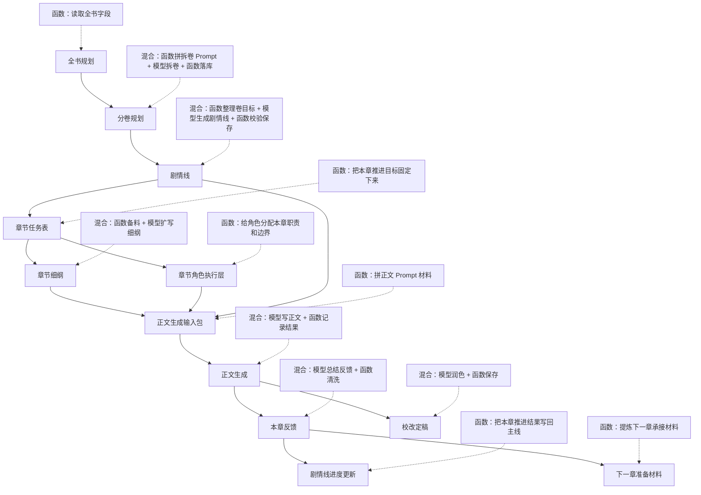
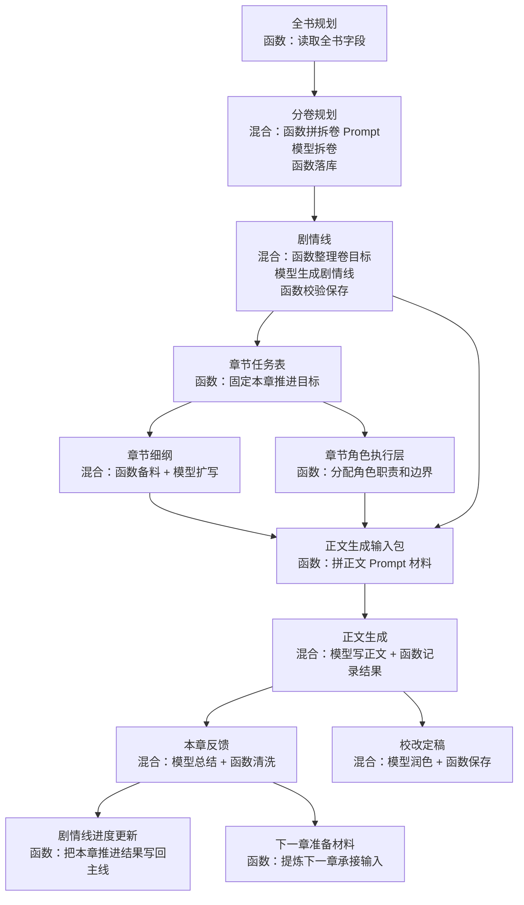

# 生成链路原理注释文档

> 适用范围：`alipro-main` 当前创作主链  
> 说明：本文件只解释主链传递关系，只保留当前前端和后端真实在跑的链路，不展开旧入口、兼容层和低频支线。

## 主链总览



## 主链总览（手机纵向版）



## 1. 全书规划

### 输入

- 书名
- 作品前提
- 全书主目标
- 全书核心冲突
- 世界规则
- 角色底盘
- 全书主线
- 分卷推进
- 详细推进

### 实现

- `函数实现`

#### 实现解释

这一层不做模型生成，主要做两件事：

1. 读取整本书长期不变的背景字段。
2. 把这些字段整理成后续分卷拆解、剧情线生成、正文生成都会反复引用的基础资料。

### 输出

- 全书规划材料包

### Prompt

- 无

---

## 2. 分卷规划

### 输入

- 书名
- 作品前提
- 全书主目标
- 全书核心冲突
- 世界规则
- 角色底盘
- 全书主线
- 分卷推进
- 详细推进
- 目标卷数

### 实现

- `混合实现`

#### 实现解释

1. 函数先读取输入字段。
2. 函数把这些字段按固定顺序拼成“分卷拆解 Prompt”。
3. 模型根据 Prompt 判断：
   - 整本书应该拆成几卷
   - 每卷阶段目标是什么
   - 每卷最核心的冲突是什么
   - 每卷开始和结束时角色状态在哪
   - 每卷大概需要多少章
4. 函数拿到模型输出后，逐卷做标准化：
   - 补默认卷名
   - 补默认章节数
   - 过滤空卷
   - 统一字段格式
5. 函数把标准化结果保存为正式分卷规划。

### 输出

- 分卷大纲

### Prompt 缩略

```text
你是一名网文分卷规划编辑。
任务：根据全书规划，拆出可以直接写入 volume_plans 的分卷规划。
只输出严格 JSON。

每卷必须包含：
- volume_number
- volume_name
- volume_theme
- stage_goal
- core_conflict
- start_role_state
- end_role_state
- estimated_chapters
- storyline_quota
- notes
```

---

## 3. 剧情线

### 输入

- 当前卷号
- 分卷大纲
- 当前卷目标
- 当前卷核心冲突
- 卷初角色状态
- 卷末角色状态
- 预计章节数
- 全书主线
- 主题底色

### 实现

- `混合实现`

#### 实现解释

1. 函数先读取当前卷的阶段目标、卷级冲突、角色状态变化和预计章节数。
2. 函数把这些字段整理成“本卷剧情线生成材料”，重点告诉模型：
   - 这一卷要解决什么阶段问题
   - 这一卷允许出现哪些长线、短线、主题线
   - 每条线大概应从哪一章起、在哪一章附近收束
3. 模型根据这些材料，产出本卷剧情线草稿：
   - 剧情线名称
   - 剧情线类型
   - 服务目标
   - 起始章节
   - 预计终止章节
   - 是否允许跨卷
4. 函数再做结构校验和标准化：
   - 补默认状态
   - 纠正非法章节范围
   - 统一字段格式
   - 保存为当前卷的正式剧情线集合

### 输出

- 本卷剧情线集合
- 每条线的初始起止章节
- 每条线的类型、优先级、状态
- 是否允许跨卷延续

### Prompt 缩略

```text
你是一名网文卷内剧情线策划编辑。
请根据当前卷的阶段目标、核心冲突、角色起止状态和预计章节数，
设计本卷应存在的剧情线集合。

每条剧情线至少输出：
- storyline_name
- storyline_type
- service_goal
- start_chapter
- end_chapter
- can_cross_volume
- closure_expectation
```

---

## 4. 章节任务表

### 输入

- 当前章号
- 主推进剧情线
- 关联剧情线
- 上一章承接说明
- 上一章反馈

### 实现

- `函数实现`

#### 实现解释

1. 系统先根据当前章号，在当前卷剧情线集合里找出“本章落在哪些剧情线区间内”。
2. 再从这些可挂载剧情线里选出：
   - 本章主推进剧情线
   - 本章关联剧情线
3. 然后把上一章必须承接的内容并入本章任务。
4. 最后补出这一章的情绪目标、结尾钩子和出场角色，形成一份“这章必须完成什么”的章节任务表。

### 输出

- 章节任务
- 情绪目标
- 上章承接说明
- 结尾钩子
- 出场角色
- 本章摘要

### Prompt

- 无

---

## 5. 章节细纲

### 输入

- 章节任务
- 情绪目标
- 上章承接说明
- 结尾钩子
- 出场角色
- 全书背景
- 当前卷背景

### 实现

- `混合实现`

#### 实现解释

1. 函数先把章节任务、卷内背景、出场角色整理成“细纲生成材料”。
2. 模型根据这些材料，把“这章要做什么”扩写成“这章怎么展开”。
3. 函数再把模型输出拆回结构化字段并保存。
4. 同时函数还会把结构化结果拼成一版可读的大纲文本，方便前端展示和正文生成继续读取。

### 输出

- 本章目标
- 关键场景
- 冲突升级
- 角色变化
- 情绪落点
- 章节展开顺序
- 自动合成大纲

### Prompt 缩略

```text
请为以下章节制定可直接执行的章节细纲。
你必须优先遵守章节任务与剧情线约束，不要自由偏航。

输出要求（当前实现见 buildOutlinePrompt，2026-08-07 起增加事件容量约束）：
1. 只输出一段连贯的章节剧情摘要，不输出标题、编号、列表、字段名。
2. 关键事件节点控制在 2-4 个；一个节点是有过程、有明确结果的完整事件。
3. 总字数控制在 220-400 字。
4. 放不下的节点拆到下一章，并在末尾写明本章停点与下章承接。
5. 每个节点都要服务当前章必须推进的剧情线节点。
```

---

## 6. 章节角色执行层

### 输入

- 出场角色
- 角色底盘
- 本章角色说明
- 章节任务

### 实现

- `函数实现`

#### 实现解释

1. 系统先取出这一章出场角色名单。
2. 再给每个角色补上长期底色。
3. 然后根据本章任务，给每个角色分配：
   - 这章负责什么
   - 这章能变化到哪
   - 这章不能提前发生什么
4. 如果没有完整填写，系统会自动给出一版保守兜底，避免正文生成时角色只有名字没有职责。

### 输出

- 角色名称
- 本章职责
- 允许变化
- 禁止变化
- 变化方向
- 变化层级

### Prompt

- 无

---

## 7. 正文生成输入包

### 输入

- 自动合成大纲
- 结构化章节细纲
- 章节任务
- 情绪目标
- 角色资料
- 章节角色执行层
- 上一章反馈
- 上章承接说明
- 主推进剧情线
- 关联剧情线
- 书名
- 题材
- 平台风格
- 目标字数

### 实现

- `函数实现`

#### 实现解释

1. 先确定“正文用大纲”：
   - 有结构化细纲时优先用结构化细纲转成的文本
   - 否则退回用自动合成大纲
2. 再拼“正文用角色资料”：
   - 资料库角色档案
   - 页面临时补充角色说明
3. 再拼“正文用创作上下文”：
   - 全书背景
   - 当前卷背景
   - 本章任务
   - 上一章反馈
   - 当前主线和支线
4. 再把章节角色执行层转成自然语言约束。
5. 最后把这些内容合并成一份完整正文 Prompt 材料包。

### 输出

- 正文生成输入包

### Prompt

- 这一层只备料，不直接生成正文

---

## 8. 正文生成

### 输入

- 正文生成输入包

### 实现

- `混合实现`

#### 实现解释

1. 函数把输入包按正文 Prompt 模板拼好。
2. 模型按这些限制真正写正文。
3. 函数把结果记录成：
   - 正文内容
   - 实际字数
   - 生成时间
   - 生成状态

### 输出

- 正文内容
- 实际字数
- 生成时间
- 生成状态

### Prompt 缩略

```text
这不是自由发挥，也不是随手续写，
而是根据已给出的章节任务表，生成可以直接入库的下一章正文。

硬约束：
- 只输出正文
- 情节必须围绕章节任务推进
- 人物行为必须贴合既有设定
- 角色变化不能突破边界
- 总字数尽量控制在目标范围内
```

---

## 9. 本章反馈

### 输入

- 正文内容
- 本章标题
- 自动合成大纲
- 章节任务
- 情绪目标
- 主推进剧情线
- 关联剧情线

### 实现

- `混合实现`

#### 实现解释

1. 模型先总结：
   - 这一章实际发生了什么
   - 主线推进到了哪里
   - 角色发生了什么变化
   - 哪些内容还没收
   - 下一章该先接什么
2. 函数再对模型结果做清洗：
   - 检查新增角色是否真的在正文里出现
   - 检查新增设定是否真的在正文里落地
   - 没证据的内容不允许进入承接层
3. 最后形成结构化本章反馈。

### 输出

- 章节摘要
- 剧情推进结果
- 角色推进结果
- 未收内容
- 下一章焦点
- 连续承接项
- 连续性风险

### Prompt 缩略

```text
你是一名连续性审计编辑。
请根据本章规划和已生成正文，输出这一章对后续创作真正有用的推进反馈。
只输出 JSON。
只抽取正文里已经写出来的事实，不要脑补缺失情节。
```

---

## 10. 剧情线进度更新

### 输入

- 章节摘要
- 剧情推进结果
- 下一章焦点
- 主推进剧情线
- 关联剧情线

### 实现

- `函数实现`

#### 实现解释

1. 系统拿到本章实际挂接的剧情线。
2. 再把本章反馈里和推进有关的内容抽出来。
3. 然后把这些推进结果写回每条相关剧情线的长期记录。
4. 最终让剧情线从静态规划变成“有当前进度”的长期状态。

### 输出

- 剧情线当前进度
- 最新推进记录
- 最近一次反馈摘要
- 是否需要复核

### Prompt

- 无

---

## 11. 下一章准备材料

### 输入

- 章节摘要
- 未收内容
- 下一章焦点
- 连续承接项
- 剧情线当前进度

### 实现

- `函数实现`

#### 实现解释

1. 系统先从本章反馈里挑出“下一章必须接”的信息。
2. 再从剧情线当前进度里挑出“下一章还得继续推”的内容。
3. 把两边合并后，变成下一章的开工材料包。

### 输出

- 下一章承接说明
- 下一章重点
- 下一章准备材料

### Prompt

- 无

---

## 12. 校改定稿

### 输入

- 当前正文
- 校改要求
- 校改重点

### 实现

- `混合实现`

#### 实现解释

1. 函数先把校改要求拼成校改 Prompt。
2. 模型按要求润色正文。
3. 函数把润色后的结果保存成校改稿或最终稿。

### 输出

- 校改稿
- 最终稿

### Prompt 缩略

```text
请根据以下要求润色网文正文。

【原文】
...

【润色要求】
...

请直接输出润色后的正文，不要解释。
```

## 一句话记忆版

- 全书规划：定整本书的大方向
- 分卷规划：把整本书拆成几卷
- 剧情线：确定这一卷里持续推进哪几件事
- 章节任务表：固定本章要完成什么
- 章节细纲：展开本章怎么写
- 章节角色执行层：决定角色这章怎么演
- 正文生成输入包：把写正文要用的材料全部拼好
- 正文生成：真正写出正文
- 本章反馈：总结这一章实际推进结果
- 剧情线进度更新：把这章结果写回长期主线
- 下一章准备材料：给下一章准备承接输入
- 校改定稿：润色并保存最终稿
